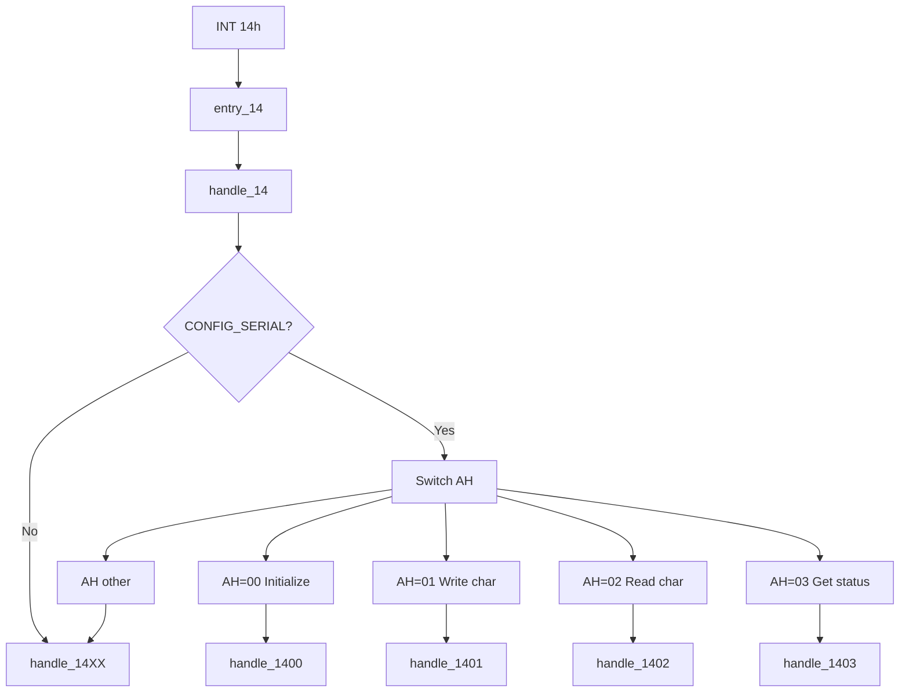

# Serial Services (INT 14h)

This page documents the BIOS serial communications services implemented in SeaBIOS and invoked via **INT 14h**. It lists every supported function (AH code), its purpose, register inputs and outputs, and how the handler uses the BDA and 8250-compatible UART registers.

Implementation is in [`src/serial.c`](src/serial.c) (handler and dispatch). UART register offsets are in [`src/hw/serialio.h`](src/hw/serialio.h). Serial port detection runs during POST in `serial_setup()`; the IVT vector 0x14 is set in [`src/post.c`](src/post.c) to `entry_14` → `handle_14`.

## Overview

- **INT 14h** is the Serial Communications Service. The handler `handle_14()` in `src/serial.c` dispatches on **AH** to initialize the port, write a character, read a character, or get port status.
- **Entry point**: `entry_14` (see [Interrupt_Descriptor_Table.md](Interrupt_Descriptor_Table.md)); IVT vector 0x14 is set in `ivt_init()` in `src/post.c`.
- **CONFIG_SERIAL**: When the `SERIAL` option is disabled in Kconfig, all INT 14h calls are routed to `handle_14XX()` and return with CF=1 (unimplemented). When enabled, COM1–COM4 are probed and base addresses and timeouts are stored in the BDA.
- **Success/error convention**: On return, the **carry flag (CF)** is clear on success and set on error (invalid port or unimplemented function). For AH=01h and AH=02h, **timeout** is indicated by **AH bit 7** set; CF remains clear.

## Calling conventions

- **Register layout** matches `struct bregs` in `src/bregs.h` (DS, ES, EDI/DI, ESI/SI, EBP/BP, EBX/BX, EDX/DX, ECX/CX, EAX/AX, and flags).
- **Port selection**: **DX** holds the COM port index (0 = COM1, 1 = COM2, 2 = COM3, 3 = COM4). The BIOS resolves the I/O base address from the BDA `port_com[dx]`. If DX ≥ 4 or the port is not present (zero in BDA), the handler sets CF=1 and returns.
- **Function code**: **AH** selects the subfunction (00h–03h supported; others unimplemented).

## BIOS Data Area (serial)

Serial-related BDA fields are documented in [BIOS_Data_Area.md](BIOS_Data_Area.md). Key locations:

| BDA offset | Field | Description |
|------------|--------|-------------|
| 0x00–0x07 | port_com[4] | I/O base addresses for COM1–COM4 (e.g. 0x3F8, 0x2F8, 0x3E8, 0x2E8). Zero if port not present. |
| 0x7C–0x7F | com_timeout[4] | Timeout in timer ticks for each COM port (e.g. 0x0A). Used by AH=01h and AH=02h. |

- **Initialization**: `serial_setup()` in `src/serial.c` probes each of the four standard base addresses, writes detected ports to `port_com[]` and sets `com_timeout[]` (0x0A per port). The equipment list (bits 9–11) is set to the number of serial ports.

## Implementation flow

## UART register summary (8250-compatible)

The handler uses the following offsets from the port base (defined in `src/hw/serialio.h`):

| Offset | Name | Purpose |
|--------|------|---------|
| 0 | DATA/DLL | Data register; or Divisor Latch Low when DLAB=1 |
| 1 | IER/DLH | Interrupt Enable; or Divisor Latch High when DLAB=1 |
| 3 | LCR | Line Control (word length, stop bits, parity, DLAB) |
| 5 | LSR | Line Status (data ready, errors, THRE, TEMT) |
| 6 | MSR | Modem Status (CTS, DSR, RI, CD and deltas) |

### LSR — Line Status Register (read)

| Bit | Name | Meaning |
|-----|------|---------|
| 0 | DR | Data Ready — receive data available |
| 1 | OE | Overrun Error |
| 2 | PE | Parity Error |
| 3 | FE | Framing Error |
| 4 | BI | Break Interrupt |
| 5 | THRE | Transmitter Holding Register Empty |
| 6 | TEMT | Transmitter Empty |
| 7 | — | Reserved (0) |

### MSR — Modem Status Register (read)

| Bit | Name | Meaning |
|-----|------|---------|
| 0 | DCTS | Delta Clear To Send |
| 1 | DDSR | Delta Data Set Ready |
| 2 | TERI | Trailing Edge Ring Indicator |
| 3 | DDCD | Delta Data Carrier Detect |
| 4 | CTS | Clear To Send (current) |
| 5 | DSR | Data Set Ready (current) |
| 6 | RI | Ring Indicator (current) |
| 7 | CD | Carrier Detect (current) |

---

## Supported functions summary

| AH | Function | Purpose |
|----|----------|---------|
| 00h | Initialize serial port | Set baud rate and line format; return LSR and MSR |
| 01h | Write character | Send AL to port; wait for THRE/TEMT or timeout |
| 02h | Read character | Read one byte into AL; wait for DR or timeout |
| 03h | Get port status | Return current LSR in AH and MSR in AL |

Any other AH value invokes `handle_14XX()` and returns **unimplemented** (CF=1; AH is not set to a specific error code by this handler).

---

### AH=00h — Initialize serial port

- **Purpose**: Initialize the asynchronous communications port with the requested baud rate and line parameters (word length, stop bits, parity). Returns the current line and modem status.
- **Inputs**: **DX** = port index (0–3). **AL** = line and baud parameters:
  - **Bits 0–1**: Word length — 00 = 5 bits, 01 = 6 bits, 10 = 7 bits, 11 = 8 bits.
  - **Bit 2**: Stop bits — 0 = 1 stop bit, 1 = 2 stop bits.
  - **Bits 3–4**: Parity — 00 = none, 01 = odd, 10 = even, 11 = stick parity.
  - **Bits 5–7**: Baud rate divisor index — 000 = default (110 baud, divisor 0x417); 001–111 = 150, 300, 600, 1200, 2400, 4800, 9600 baud (divisor derived from `0x600 >> (bits 5–7)`).
- **Outputs**: **AH** = LSR, **AL** = MSR; CF=0. On invalid port, CF=1 and handler returns without updating AX.
- **Implementation**: `handle_1400()`. Sets LCR DLAB bit, writes divisor (DLL/DLH) from AL bits 5–7 (default 0x17, 0x04 when bits 5–7 = 0), writes AL & 0x1F to LCR, then reads LSR and MSR into AH and AL.
- **Relation**: Call before using AH=01h/AH=02h to set baud and format. AH=03h returns the same status registers without changing configuration.

---

### AH=01h — Write character to port

- **Purpose**: Send one character (in AL) to the serial port. The BIOS waits until the transmitter is ready (LSR bits 5 and 6 set) or until the port’s timeout expires.
- **Inputs**: **DX** = port index (0–3). **AL** = character to send.
- **Outputs**: **AH** = LSR at completion; **AH bit 7** is set if the operation timed out (transmitter not ready within `com_timeout[dx]` ticks). CF=0 in all cases (timeout is indicated by AH bit 7, not CF). On invalid port, CF=1.
- **Implementation**: `handle_1401()`. Computes timeout end from `irqtimer_calc_ticks(GET_BDA(com_timeout[regs->dx]))`. Loops reading LSR; when (LSR & 0x60) == 0x60, writes AL to DATA and returns with AH=LSR. On `irqtimer_check(end)`, returns with AH = LSR | 0x80. Uses `yield()` while waiting.
- **Relation**: Use after AH=00h to send data; AH=03h can be used to poll for transmitter ready.

---

### AH=02h — Read character from port

- **Purpose**: Read one character from the serial port. The BIOS waits until data is available (LSR bit 0 set) or until the port’s timeout expires.
- **Inputs**: **DX** = port index (0–3).
- **Outputs**: **AL** = received character; **AH** = LSR at completion; **AH bit 7** is set if the operation timed out (no data within `com_timeout[dx]` ticks). CF=0 in all cases. On invalid port, CF=1.
- **Implementation**: `handle_1402()`. Uses the same timeout mechanism as AH=01h. Loops reading LSR; when LSR & 0x01, reads DATA into AL and returns with AH=LSR. On timeout, returns with AH = LSR | 0x80 (AL is not updated with received data). Uses `yield()` while waiting.
- **Relation**: Use after AH=00h to receive data; AH=03h can be used to poll for data ready (LSR bit 0).

---

### AH=03h — Get port status

- **Purpose**: Return the current line and modem status of the serial port without changing configuration or transferring data.
- **Inputs**: **DX** = port index (0–3).
- **Outputs**: **AH** = LSR, **AL** = MSR; CF=0. On invalid port, CF=1.
- **Implementation**: `handle_1403()`. Reads LSR and MSR from the UART and stores them in AH and AL.
- **Relation**: Same status values as returned by AH=00h; useful for polling before AH=01h/AH=02h or for modem/line state.

---

## Unsupported functions

For **AH ≥ 04h** (and when **CONFIG_SERIAL** is disabled for any AH), the handler calls `handle_14XX()`, which invokes `set_unimplemented(regs)`. This sets **CF=1** and does not define a specific value in AH (unlike handlers that use `set_code_unimplemented(regs, RET_EUNSUPPORTED)` with AH=0x86). Callers should not rely on AH for unimplemented INT 14h functions.

---

## Related documentation

- [Interrupt_Descriptor_Table.md](Interrupt_Descriptor_Table.md) — Vector 0x14 and entry point `entry_14`.
- [BIOS_Data_Area.md](BIOS_Data_Area.md) — `port_com[4]` and `com_timeout[4]`.
- INT 17h (Printer) is implemented in the same file, `src/serial.c` (`handle_17`, LPT ports).
