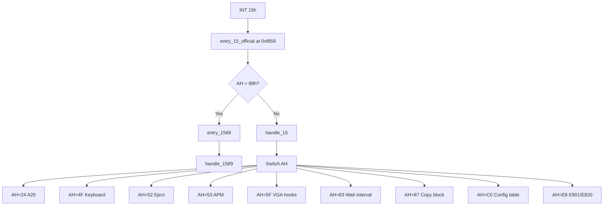

# System Services (INT 15h)

This page documents the BIOS system services implemented in SeaBIOS and invoked via **INT 15h**. It lists every supported function (AH code and subfunctions), register inputs and outputs, and how each relates to memory, power management, mouse, VGA hooks, and timing.

Implementation is in `src/system.c` (main handler `handle_15()` and most subfunctions), `src/clock.c` (AH=83h, 86h), `src/apm.c` (AH=53h), `src/mouse.c` (AH=C2h), and `src/vgahooks.c` (AH=5Fh, 7Fh). Entry is at fixed address 0xf859 (`entry_15_official` in `src/romlayout.S`); AH=89h uses a separate entry `entry_1589` because it returns in protected mode.

## Overview

- **INT 15h** is the system services interrupt. The handler `handle_15()` in `src/system.c` dispatches by AH; several AH codes are implemented in other files.
- **Entry**: `entry_15_official` at 0xf859. When AH=89h, control branches to `entry_1589` (switch to protected mode); otherwise `IRQ_ENTRY_ARG 15` invokes `handle_15`.
- **Success/error convention**: On return, **carry flag (CF)** is clear on success and set on error. **AH** holds the status code (0 = success; non-zero values such as 0x86 = RET_EUNSUPPORTED). Unsupported AH codes return CF=1, AH=0x86.

## Calling conventions

- **Register layout** matches `struct bregs` in `src/bregs.h` (DS, ES, EDI/DI, ESI/SI, EBP/BP, EBX/BX, EDX/DX, ECX/CX, EAX/AX, and flags). Segment:offset pointers use ES or DS as documented per function.
- **Function code** is in **AH**; many functions use **AL** (and sometimes BH, BL) for subfunctions.

## Implementation flow

## Function summary

| AH  | Function                           | Purpose |
|-----|------------------------------------|---------|
| 24h | A20 gate control                   | Enable/disable/get A20; support mask |
| 4Fh | Keyboard intercept                 | Hook on INT 09h; returns invalid |
| 52h | Removable media eject              | Stub; used by INT 13h AH=46h |
| 53h | APM BIOS                           | Power management (requires CONFIG_APMBIOS) |
| 5Fh | VGA option ROM (Intel/VIA)         | Panel/display info (requires CONFIG_VGAHOOKS) |
| 7Fh | VGA option ROM (SMI)               | Boot display override (requires CONFIG_VGAHOOKS) |
| 83h | User wait interval                | Set/cancel RTC-based wait (requires CONFIG_RTC_TIMER) |
| 86h | Wait for time                      | Block for CX:DX microseconds (requires CONFIG_RTC_TIMER) |
| 87h | Copy memory block                  | Protected-mode copy; A20 enabled |
| 88h | Get extended memory size           | Extended memory in KB (capped 63 MB) |
| 89h | Switch to protected mode          | Enter PM; separate entry; returns in PM |
| 90h | Device busy                       | Stub |
| 91h | Interrupt complete                 | Stub |
| C0h | Get system configuration           | Pointer to BIOS configuration table |
| C1h | Get EBDA segment                   | Extended BIOS Data Area segment |
| C2h | Mouse interface                    | Enable/disable, reset, rate, handler (requires CONFIG_MOUSE) |
| E8h | Extended memory (E801/E820)        | E801 size; E820 memory map |

**Unimplemented**: AH=85h (SysReq — keyboard driver invokes it; handler returns EUNSUPPORTED). Any other AH not in the switch returns CF=1, AH=0x86 (RET_EUNSUPPORTED).

---

## AH=24h — A20 gate control

- **Purpose**: Control or query the A20 address line (required for access above 1 MB in real mode).
- **Inputs**: AL = subfunction (0x00–0x03).
- **Outputs**: CF=0 on success. AL=02: AL = current A20 state (0/1). AL=03: BX = support mask (3 = 16-bit interface supported).
- **Implementation**: `handle_1524()` in `src/system.c`. AL=00: `set_a20(0)`; AL=01: `set_a20(1)`; AL=02: AL = `get_a20()`; AL=03: BX=3. Other AL: RET_EUNSUPPORTED.

---

## AH=4Fh — Keyboard interrupt intercept

- **Purpose**: Called by the keyboard interrupt handler (INT 09h) when `CONFIG_KBD_CALL_INT15_4F` is set; allows a handler to intercept or replace the scancode.
- **Inputs**: AL = scancode (when invoked from `process_key()` in `src/kbd.c`).
- **Outputs**: CF=1 (invalid) — SeaBIOS does not consume the key; caller may replace key if CF=0 and AL modified.
- **Implementation**: `handle_154f()` → `set_invalid_silent(regs)`. The BIOS always returns “not handled”; no key replacement.

---

## AH=52h — Removable media eject

- **Purpose**: Eject removable media. Used by INT 13h AH=46h (Eject media) for CD-ROM; see [Disk_Services.md](Disk_Services.md).
- **Inputs**: DL = drive number (passed through from INT 13h).
- **Outputs**: CF=0, AH=0 (success). Stub implementation does not perform hardware eject.
- **Implementation**: `handle_1552()` in `src/system.c`; always `set_code_success(regs)`.

---

## AH=53h — APM BIOS (Advanced Power Management)

- **Purpose**: Power management interface: install check, connect, idle/busy, set power state, get power status, etc.
- **Inputs**: AL = subfunction; additional inputs per subfunction (BX, CX, ES, etc.).
- **Outputs**: Varies by subfunction; CF=0 on success. When unsupported or not built with CONFIG_APMBIOS: CF=1, AH=0x86.
- **Implementation**: `handle_1553()` in `src/apm.c` (when `CONFIG_APMBIOS`). Subfunctions:

| AL  | Function                  | Notes |
|-----|----------------------------|-------|
| 00h | APM installation check    | AH=1, AL=2, BH='P', BL='M', CX=0x03 (16/32-bit interface) |
| 01h | Real-mode connect          | Success |
| 02h | 16-bit protected-mode connect | BX=offset of entry_apm16, AX=segment, SI=0xfff0, CX/DI = data seg |
| 03h | 32-bit protected-mode connect | AX=code seg, EBX=entry_apm32, CX/ESI/DX/DI = segments and sizes |
| 04h | Disconnect                 | Success |
| 05h | CPU idle                   | yield_toirq(); success |
| 06h | CPU busy                   | Success |
| 07h | Set power state            | BX=1 (APM device): CX=1 standby, 2 suspend, 3 off; CX=3 calls apm_shutdown() (ACPI PM1a or HLT) |
| 08h | (reserved)                 | Success |
| 0Ah | Get power status           | BH=0x01 (on line), BL=0xff, CH=0x80 (no system battery), CL/DX/SI = unknown |
| 0Bh | Get PM event               | CF=1, AH=0x80 (no event) |
| 0Eh | APM driver version         | AH=1, AL=2 |
| 0Fh | Engage/disengage           | Success |
| 10h | Get capabilities          | BL=0, CX=0 |

---

## AH=5Fh — VGA option ROM hooks (Intel / VIA)

- **Purpose**: Hardware-specific VGA/display callbacks for some Intel and VIA on-board VGA.
- **Inputs**: AL = subfunction; other registers per vendor.
- **Outputs**: Vendor-specific; EAX=0x5F often indicates success. When `CONFIG_VGAHOOKS` is disabled or vendor unknown: CF=1, AH=0x86.
- **Implementation**: `handle_155f()` in `src/vgahooks.c`. Setup is board-specific in `vgahook_setup()` (KONTRON, GETAC, RODA, Win Enterprise, VIA, Intel).

  - **VIA**: AL=01 (panel type; CL=2), AL=02 (TV/CRT; BX=2, CX=0x401), AL=18 (framebuffer size/speed in EBX), AL=19 (invalid).
  - **Intel**: AL=35 (display type in CL), AL=40 (display ID in CL), AL=50 (Dell hook; success).

---

## AH=7Fh — VGA option ROM hooks (SMI)

- **Purpose**: Silicon Motion (and similar) VGA callbacks; e.g. boot display override.
- **Inputs**: AL = subfunction (0x02, 0x14 supported when SMI handler active).
- **Outputs**: AX=0x7F on success; BL = value (e.g. SmiBootDisplay for AL=02). Otherwise CF=1, AH=0x86.
- **Implementation**: `handle_157f()` in `src/vgahooks.c`. SMI type set for Win Enterprise MB6047: AL=02 returns boot display (BL=2); AL=14 returns ReduceOn status (BL=0).

---

## AH=83h — User wait interval

- **Purpose**: Set or cancel an RTC-based wait; when the interval elapses, bit 7 of the caller’s flag byte is set (via IRQ8/INT 70h).
- **Inputs**: AL=0x00: set interval — ES:BX = segment:offset of flag byte; CX:DX = interval in microseconds. AL=0x01: cancel interval.
- **Outputs**: CF=0 on success. AL=00: CF=1, AH=0x86 if an interval is already active.
- **Implementation**: `handle_1583()` in `src/clock.c`. Uses `set_usertimer()`; BDA fields `rtc_wait_flag`, `user_wait_complete_flag`, `user_wait_timeout`; completion in `handle_70()` (INT 70h). Requires `CONFIG_RTC_TIMER`.

---

## AH=86h — Wait for time

- **Purpose**: Block until the specified number of microseconds has elapsed (RTC-based).
- **Inputs**: CX:DX = time in microseconds (32-bit value).
- **Outputs**: CF=0 on success. CF=1, AH=0x83 if another wait (AH=83h or AH=86h) is already in use; CF=1, AH=0x86 if CONFIG_RTC_TIMER is disabled.
- **Implementation**: `handle_1586()` in `src/clock.c`; uses `set_usertimer()` with a local flag and `yield_toirq()` until the flag is set.

---

## AH=87h — Copy memory block

- **Purpose**: Copy a block of memory (e.g. across 64 KB boundaries or to/from high memory) by switching to protected mode and using segment descriptors.
- **Inputs**: ES:SI = pointer to GDT descriptor table (6 entries: null, GDT, source, dest, CS, SS); CX = number of words to copy. Descriptor layout in `src/system.c`: entries 2 and 3 are source and destination; BIOS fills GDT, CS, SS.
- **Outputs**: CF=0 on success. A20 is enabled for the duration of the copy and restored on exit.
- **Implementation**: `handle_1587()` in `src/system.c`. Switches to protected mode, performs rep movsl/movsw, returns to real mode. Used by `src/hw/ramdisk.c` and `vgasrc/vgafb.c` (e.g. framebuffer access).

---

## AH=88h — Get extended memory size

- **Purpose**: Return the size of extended memory (above 1 MB) in kilobytes.
- **Inputs**: None.
- **Outputs**: CF=0; AX = (LegacyRamSize - 1 MB) / 1024, capped at 63 MB (63*1024 = 64512). LegacyRamSize from `malloc.h`.
- **Implementation**: `handle_1588()` in `src/system.c`.

---

## AH=89h — Switch to protected mode

- **Purpose**: Switch the CPU to protected mode using a caller-provided GDT; control returns in protected mode.
- **Inputs**: ES:SI = GDT pointer; BL = PIC1 base, BH = PIC2 base. Caller must set up GDT entries; BIOS fills the code segment descriptor (7th entry) for the BIOS segment.
- **Outputs**: CF=0; CPU in protected mode; DS = 3<<3, ES = 4<<3, CS = 6<<3 (GDT selectors); PIC reprogrammed with BL/BH.
- **Implementation**: `entry_15_official` branches to `entry_1589` when AH=89h; `handle_1589()` in `src/system.c` sets A20, calls `pic_reset(regs->bl, regs->bh)`, fills GDT entry for BIOS code, sets DS/ES/CS, then executes LGDT, LIDT, set CR0.PE, far jump. Does not return to real mode.

---

## AH=90h — Device busy

- **Purpose**: Notify BIOS that a device is busy (e.g. keyboard polling).
- **Inputs**: Optional (device type in AL per RBIL).
- **Outputs**: None. Stub.
- **Implementation**: `handle_1590()` in `src/system.c`; no-op.

---

## AH=91h — Interrupt complete

- **Purpose**: Notify BIOS that a device interrupt has been serviced (e.g. keyboard data available).
- **Inputs**: Optional (device type in AL per RBIL).
- **Outputs**: None. Stub.
- **Implementation**: `handle_1591()` in `src/system.c`; no-op.

---

## AH=C0h — Get system configuration

- **Purpose**: Return a pointer to the BIOS configuration table (model, submodel, revision, feature flags).
- **Inputs**: None.
- **Outputs**: CF=0; ES:BX = pointer to `BIOS_CONFIG_TABLE` (fixed at segment 0xF000, offset 0xe6f5 in typical builds).
- **Implementation**: `handle_15c0()` in `src/system.c`; ES = SEG_BIOS, BX = &BIOS_CONFIG_TABLE. Structure `struct bios_config_table_s` in `src/std/bda.h`: size (u16), model, submodel, biosrev (u8), feature1–feature5 (u8).

### Feature byte 1 (feature1)

| Bit | Mask   | Name         | Description |
|-----|--------|--------------|-------------|
| 0   | 0x01   | CBT_F1_MCAISA | Dual bus (MCA + ISA) |
| 1   | 0x02   | CBT_F1_MCA   | Micro Channel |
| 2   | 0x04   | CBT_F1_EBDA  | Extended BIOS area allocated |
| 3   | 0x08   | CBT_F1_WAITEXT | Wait for external event (INT 15/AH=41h) |
| 4   | 0x10   | CBT_F1_INT154F | INT 15/AH=4Fh on INT 09h |
| 5   | 0x20   | CBT_F1_RTC   | Real-Time Clock installed |
| 6   | 0x40   | CBT_F1_2NDPIC | Second 8259 installed |
| 7   | 0x80   | CBT_F1_DMA3USED | DMA channel 3 used by HD BIOS |

SeaBIOS sets: 2nd PIC, RTC, EBDA, and optionally INT15/4F per CONFIG_KBD_CALL_INT15_4F.

### Feature byte 2 (feature2)

| Bit | Mask   | Name          | Description |
|-----|--------|---------------|-------------|
| 6   | 0x40   | CBT_F2_INT1609 | INT 16/AH=09h supported |

---

## AH=C1h — Get EBDA segment

- **Purpose**: Return the segment of the Extended BIOS Data Area (EBDA).
- **Inputs**: None.
- **Outputs**: CF=0; ES = EBDA segment (from `get_ebda_seg()`).
- **Implementation**: `handle_15c1()` in `src/system.c`. See [Extended_BIOS_Data_Area.md](Extended_BIOS_Data_Area.md) for EBDA layout.

---

## AH=C2h — Mouse interface

- **Purpose**: Enable/disable mouse, set sample rate and resolution, get ID, initialize, set user callback (PS/2-style).
- **Inputs**: AL = subfunction (0x00–0x07); BH, BL, ES:BX as documented below.
- **Outputs**: CF=0 on success; various return values in BL, BH, CL, DL. CF=1, AH = error (e.g. RET_EINVFUNCTION, RET_ENOHANDLER, RET_ENEEDRESEND). Requires `CONFIG_MOUSE`; otherwise CF=1, AH=0x86.
- **Implementation**: `handle_15c2()` in `src/mouse.c`. EBDA fields: `mouse_flag1`, `mouse_flag2`, `far_call_pointer`, `mouse_data` (see [Extended_BIOS_Data_Area.md](Extended_BIOS_Data_Area.md)).

| AL  | BH   | Function                  | Notes |
|-----|------|---------------------------|-------|
| 00h | 00h  | Disable mouse             | PSMOUSE_CMD_DISABLE |
| 00h | 01h  | Enable mouse              | Handler must be installed (C2/07) |
| 01h | —    | Reset mouse               | Returns ID in BL, BH |
| 02h | index| Set sample rate           | BH = index into 10,20,40,60,80,100,200 |
| 03h | res  | Set resolution            | BH = 0–3 (25/50/100/200 dpi) |
| 04h | —    | Get device ID             | BH = ID |
| 05h | 03h  | Initialize mouse          | BH=3 (3-byte packets); sets EBDA |
| 06h | 00h  | Return status             | BL, CL, DL = mouse info |
| 06h | 01h  | Set scaling 1:1           | |
| 06h | 02h  | Set scaling 2:1           | |
| 07h | —    | Set mouse handler address | ES:BX = far callback; 0000:0000 = remove |

User callback is invoked on mouse events with (status, X, Y, Z) via `invoke_mouse_handler()`.

---

## AH=E8h — Extended memory (E801 / E820)

- **Purpose**: Report extended memory size (E801) or return the system memory map one entry at a time (E820).
- **Inputs**: AL = subfunction. E801: none. E820: EDX=0x534D4150 ('SMAP'), EBX = entry index (0-based), ES:DI = buffer, ECX = buffer size (≥ 20).
- **Outputs**: See below. Invalid or unsupported: CF=1, AH=0x86.

### AL=01h — E801 get extended memory

- **Outputs**: CF=0. CX = extended memory 1–16 MB in KB (max 15*1024); DX = extended memory above 16 MB in 64 KB blocks. AX = CX, BX = DX. If total &gt; 16 MB: CX = 15*1024, DX = (LegacyRamSize - 16 MB) / 64 KB; else CX = (LegacyRamSize - 1 MB) / 1024, DX = 0.
- **Implementation**: `handle_15e801()` in `src/system.c`.

### AL=20h — E820 get memory map

- **Outputs**: CF=0; one `struct e820entry` copied to ES:DI: `start` (u64), `size` (u64), `type` (u32). EAX = 0x534D4150; ECX = 20; EBX = next index or 0 if last entry. Caller calls repeatedly with incrementing EBX until EBX=0. Types in `src/e820map.h`: E820_RAM (1), E820_RESERVED (2), E820_ACPI (3), E820_NVS (4), E820_UNUSABLE (5).
- **Implementation**: `handle_15e820()` in `src/system.c`; validates EDX and ECX, copies `e820_list[regs->bx]` via `memcpy_far`, updates EBX for next call. Map built at boot in `e820map.c`.

---

## Build configuration

The following Kconfig options enable or affect INT 15h functions:

| Option                  | Effect |
|-------------------------|--------|
| CONFIG_APMBIOS          | Enables AH=53h (APM) |
| CONFIG_RTC_TIMER        | Enables AH=83h, AH=86h |
| CONFIG_MOUSE            | Enables AH=C2h |
| CONFIG_VGAHOOKS         | Enables AH=5Fh, AH=7Fh |
| CONFIG_KBD_CALL_INT15_4F | INT 09h calls AH=4Fh on each key; BIOS_CONFIG_TABLE feature1 bit 4 |

---

## Related documentation

- [Disk_Services.md](Disk_Services.md) — INT 13h AH=46h uses INT 15h AH=52h for eject
- [Extended_BIOS_Data_Area.md](Extended_BIOS_Data_Area.md) — EBDA layout, mouse fields (AH=C1h, AH=C2h)
- [BIOS_Data_Area.md](BIOS_Data_Area.md) — User wait fields (AH=83h, 86h)
- [Interrupt_Descriptor_Table.md](Interrupt_Descriptor_Table.md) — INT 15h entry and handler listing
