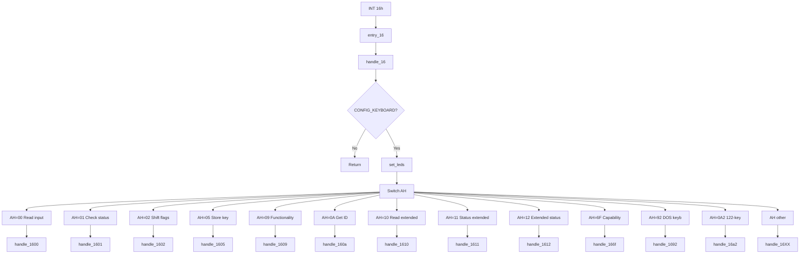

# Keyboard Services (INT 16h)

This page documents the BIOS keyboard services implemented in SeaBIOS and invoked via **INT 16h**. It lists every supported function (AH code), its purpose, register inputs and outputs, and how the handler uses the BDA and keyboard buffer.

Implementation is in [`src/kbd.c`](src/kbd.c) (handler and dispatch). Keyboard hardware is driven by the PS/2 or USB HID layer ([`src/hw/ps2port.c`](src/hw/ps2port.c), [`src/hw/usb-hid.c`](src/hw/usb-hid.c)). The IVT vector 0x16 is set in [`src/post.c`](src/post.c) to `entry_16` → `handle_16`. Keyboard buffer and BDA fields are initialized by `kbd_init()` during POST.

## Overview

- **INT 16h** is the Keyboard Service. The handler `handle_16()` in `src/kbd.c` dispatches on **AH** to read keys, check status, get shift flags, store keystrokes, or report capabilities.
- **Entry point**: `entry_16` (see [Interrupt_Descriptor_Table.md](Interrupt_Descriptor_Table.md)); IVT vector 0x16 is set in `ivt_init()` in `src/post.c`.
- **CONFIG_KEYBOARD**: When the `KEYBOARD` option is disabled in Kconfig, `handle_16()` returns immediately without performing any function. When enabled, all 12 subfunctions are available.
- **Blocking**: AH=00h and AH=10h wait (via `yield_toirq()`) until a key is available. AH=01h and AH=11h return immediately; **ZF=1** if no key, **ZF=0** if a key is available.
- **Unsupported AH**: Any AH not in the switch invokes `handle_16XX()` → `warn_unimplemented(regs)`; no standard CF or register convention is guaranteed.

## Calling conventions

- **Register layout** matches `struct bregs` in `src/bregs.h` (DS, ES, EDI/DI, ESI/SI, EBP/BP, EBX/BX, EDX/DX, ECX/CX, EAX/AX, and flags).
- **Function code**: **AH** selects the subfunction. Supported: 00h, 01h, 02h, 05h, 09h, 0Ah, 10h, 11h, 12h, 6Fh, 92h, 0A2h.
- **Keycode format** (for AH=00h, 01h, 05h, 10h, 11h): **AX** = 16-bit keycode with **AL** = ASCII character (or 0x00 for non-printable) and **AH** = scancode. Extended keys may use special encodings (e.g. extended Enter → 0x1c0d).

## BIOS Data Area (keyboard)

Keyboard-related BDA fields are documented in [BIOS_Data_Area.md](BIOS_Data_Area.md). Key locations:

| BDA offset | Field | Description |
|------------|--------|-------------|
| 0x17 | kbd_flag0 | Shift/modifier and lock flags (KF0_RSHIFT, KF0_LSHIFT, KF0_CTRLACTIVE, KF0_ALTACTIVE, KF0_SCROLLACTIVE, KF0_NUMACTIVE, KF0_CAPSACTIVE, etc.). |
| 0x1A | kbd_buf_head | Head pointer for keyboard circular buffer (offset within BDA segment). |
| 0x1C | kbd_buf_tail | Tail pointer for keyboard circular buffer. |
| 0x1E | kbd_buf[32] | 32-byte circular buffer holding 16 keycodes (each 2 bytes). |
| 0x80 | kbd_buf_start_offset | Start offset of keyboard buffer. |
| 0x82 | kbd_buf_end_offset | End offset of keyboard buffer. |
| 0x96 | kbd_flag1 | Extended flags (KF1_LAST_E0, KF1_LAST_E1, KF1_RCTRL, KF1_RALT, KF1_101KBD). |
| 0x97 | kbd_led | Current LED state (Num/Caps/Scroll) mirrored from kbd_flag0. |
| 0x71 | break_flag | Set to 0x80 on Ctrl+Break. |

- **Initialization**: `kbd_init()` in `src/kbd.c` sets `kbd_flag1` to KF1_101KBD, and sets `kbd_buf_head`, `kbd_buf_tail`, `kbd_buf_start_offset`, and `kbd_buf_end_offset` so the buffer spans `kbd_buf`. Keys are enqueued by the INT 09h (keyboard IRQ) handler and by AH=05h; they are dequeued by AH=00h, 01h, 10h, 11h.
- **LED sync**: At each INT 16h entry, `set_leds()` runs: it syncs Num Lock, Caps Lock, and Scroll Lock from `kbd_flag0` to the keyboard hardware via `ATKBD_CMD_SETLEDS` (PS/2 or USB).

## Implementation flow

## Supported functions summary

| AH | Function | Purpose |
|----|----------|---------|
| 00h | Read keyboard input | Wait for key; return keycode in AX; remove from buffer |
| 01h | Check keyboard status | Peek buffer; ZF=1 if empty, ZF=0 if key available; do not remove |
| 02h | Get shift flag status | Return kbd_flag0 low byte in AL |
| 05h | Store keystroke in buffer | Put CX into buffer; AL=0 success, AL=1 buffer full |
| 09h | Get keyboard functionality | Return capability bits in AL (0x30) |
| 0Ah | Get keyboard ID | Return keyboard ID in BX (from ATKBD_CMD_GETID) |
| 10h | Read MF-II keyboard input | Same as 00h with extended scancodes (no E0 translation) |
| 11h | Check MF-II keyboard status | Same as 01h with extended scancodes |
| 12h | Get extended keyboard status | Return merged kbd_flag0/kbd_flag1 in AX |
| 6Fh | Keyboard capability check | AL=08h: set AH=2 (normal keyboard, 08h unsupported) |
| 92h | Keyboard capability (DOS keyb) | Set AH=0x80 (AH=10h–12h supported) |
| 0A2h | 122-key capability check | No change to AH (122-key / AH=20h–22h not supported) |

Any other AH value invokes `handle_16XX()` and triggers `warn_unimplemented(regs)`.

---

### AH=00h — Read keyboard input

- **Purpose**: Wait until a key is available in the keyboard buffer, then return its keycode in AX and remove it from the buffer.
- **Inputs**: **AH** = 0x00. No other inputs.
- **Outputs**: **AX** = keycode (AL = ASCII, AH = scancode). For extended keys, the BIOS may translate (e.g. extended Enter → 0x1c0d, extended '/' → 0x352f). If the low byte was 0xe0 and high byte non-zero, AH is left as the scancode and AL cleared; if 0xf0 in low byte with high byte set, only the high byte is returned. Other registers and flags (except as modified by entry/exit) are preserved.
- **Implementation**: `handle_1600()`. Calls `dequeue_key(regs, 1, 0)`: waits in a loop with `yield_toirq()` until `kbd_buf_head != kbd_buf_tail`, then reads the 16-bit keycode, applies translation for extended keys (extended=0), writes AX, and advances `kbd_buf_head`.
- **Relation**: Use AH=01h to peek without waiting or removing. Use AH=10h for the same wait/read behavior without E0 translation.

---

### AH=01h — Check keyboard status

- **Purpose**: Check whether a key is available in the buffer without removing it. Returns immediately.
- **Inputs**: **AH** = 0x01.
- **Outputs**: **ZF=1** if buffer empty; **ZF=0** if a key is available. When a key is available, **AX** holds that keycode (same format as AH=00h). The key remains in the buffer.
- **Implementation**: `handle_1601()`. Calls `dequeue_key(regs, 0, 0)`: if buffer empty, sets ZF and returns; otherwise reads keycode (with translation), sets AX and clears ZF, and does not advance head.
- **Relation**: Used by callers (e.g. `check_for_keystroke()` in `src/boot.c`) to poll before reading with AH=00h.

---

### AH=02h — Get shift flag status

- **Purpose**: Return the current keyboard shift/modifier and lock state (low byte of kbd_flag0).
- **Inputs**: **AH** = 0x02.
- **Outputs**: **AL** = value of BDA `kbd_flag0` (low byte). Bit definitions in `src/std/bda.h`: KF0_RSHIFT, KF0_LSHIFT, KF0_CTRLACTIVE, KF0_ALTACTIVE, KF0_SCROLLACTIVE, KF0_NUMACTIVE, KF0_CAPSACTIVE.
- **Implementation**: `handle_1602()`. After `yield()`, sets `regs->al = GET_BDA(kbd_flag0)`.
- **Relation**: AH=12h returns the full extended status (kbd_flag0 with kbd_flag1 RALT/RCTRL merged into the high byte).

---

### AH=05h — Store keystroke in buffer

- **Purpose**: Insert a keycode into the keyboard buffer (software-generated keystroke).
- **Inputs**: **AH** = 0x05, **CX** = keycode to store (same format as returned by AH=00h: CH = scancode, CL = ASCII).
- **Outputs**: **AL** = 0 if the key was enqueued successfully; **AL** = 1 if the buffer was full and the key was not stored.
- **Implementation**: `handle_1605()`. Sets `regs->al = !enqueue_key(regs->cx)`. `enqueue_key()` advances tail, writes the 16-bit keycode at the tail, and returns 1 on success, 0 if buffer full (head would equal new tail).
- **Relation**: Use when emulating or injecting keystrokes. Buffer size is 16 keycodes (32 bytes).

---

### AH=09h — Get keyboard functionality

- **Purpose**: Report which INT 16h extended functions are supported. Used by the BIOS Configuration Table and by software that checks capabilities.
- **Inputs**: **AH** = 0x09.
- **Outputs**: **AL** = 0x30. Bit meaning (from handler comments): bit 7 reserved (0); bit 6 = INT 16/AH=20h–22h supported (0); bit 5 = INT 16/AH=10h–12h supported (1); bit 4 = INT 16/AH=0Ah supported (1); bits 3–0 = INT 16/AX=0306h, 0305h, 0304h, 0300h supported (all 0).
- **Implementation**: `handle_1609()`. Sets `regs->al = 0x30` (enhanced keyboard and AH=0Ah supported; 122-key and AX=0300h–0306h not supported).
- **Relation**: BIOS Config Table feature2 bit 6 (CBT_F2_INT1609) in `src/misc.c` indicates AH=09h support.

---

### AH=0Ah — Get keyboard ID

- **Purpose**: Read the keyboard device ID from the controller (PS/2 or USB HID).
- **Inputs**: **AH** = 0x0A.
- **Outputs**: **BX** = keyboard ID (e.g. 0xAB83 for many PS/2 keyboards). On failure of the underlying command, **BX** = 0.
- **Implementation**: `handle_160a()`. Calls `kbd_command(ATKBD_CMD_GETID, param)`; on success sets `regs->bx = (param[1] << 8) | param[0]`, else `regs->bx = 0`.
- **Relation**: Uses the same command path as the rest of the keyboard (PS/2 or USB). See `src/hw/ps2port.h` for ATKBD_CMD_GETID.

---

### AH=10h — Read MF-II keyboard input

- **Purpose**: Same as AH=00h (wait for key, return in AX, remove from buffer) but without translating extended (E0) keys. The keycode is returned with the raw extended scancode in AH where applicable.
- **Inputs**: **AH** = 0x10.
- **Outputs**: **AX** = keycode. AL = ASCII (or 0x00); AH = scancode. No translation is applied (e.g. extended Enter stays 0xe00d/0xe00a, extended '/' stays 0xe02f; 0xe0 prefix can remain in low byte where applicable).
- **Implementation**: `handle_1610()`. Calls `dequeue_key(regs, 1, 1)` (incr=1, extended=1). Same wait and buffer logic as AH=00h.
- **Relation**: Use for programs that need raw extended scancodes. AH=11h is the non-destructive peek for this mode.

---

### AH=11h — Check MF-II keyboard status

- **Purpose**: Same as AH=01h but for the extended (MF-II) mode: peek at the next key without removing it, returning the raw keycode (no E0 translation).
- **Inputs**: **AH** = 0x11.
- **Outputs**: **ZF=1** if no key; **ZF=0** if key available, with **AX** = keycode (extended format). Key remains in buffer.
- **Implementation**: `handle_1611()`. Calls `dequeue_key(regs, 0, 1)`.
- **Relation**: Peek counterpart to AH=10h.

---

### AH=12h — Get extended keyboard status

- **Purpose**: Return the full 16-bit keyboard status, merging kbd_flag0 with the right-hand modifier bits (RCTRL, RALT) from kbd_flag1 into the high byte.
- **Inputs**: **AH** = 0x12.
- **Outputs**: **AX** = (kbd_flag0 with bits 8–9 cleared for RCTRL/RALT) OR (kbd_flag1 bits 2–3 shifted left by 8). So the high byte includes KF1_RCTRL and KF1_RALT; the low byte and other bits match kbd_flag0.
- **Implementation**: `handle_1612()`. After `yield()`, sets `regs->ax = ((GET_BDA(kbd_flag0) & ~((KF1_RCTRL|KF1_RALT) << 8)) | ((GET_BDA(kbd_flag1) & (KF1_RCTRL|KF1_RALT)) << 8))`.
- **Relation**: Extended version of AH=02h; use when right Ctrl/Alt state is needed.

---

### AH=6Fh — Keyboard capability check

- **Purpose**: Used by some software to detect keyboard type. AL=08h is interpreted as a query for a specific capability; SeaBIOS reports it as unsupported (normal keyboard).
- **Inputs**: **AH** = 0x6F, **AL** = 0x08 (other AL values are not handled).
- **Outputs**: If **AL** = 0x08 on entry, **AH** is set to 2 (unsupported / normal keyboard). Other registers unchanged for this case.
- **Implementation**: `handle_166f()`. Only when `regs->al == 0x08` sets `regs->ah = 2`.
- **Relation**: Compatibility hook for programs that probe for special keyboard support.

---

### AH=92h — Keyboard capability (DOS keyb)

- **Purpose**: Called by DOS 5.0+ KEYB to detect whether INT 16h AH=10h–12h (enhanced keyboard) is supported.
- **Inputs**: **AH** = 0x92.
- **Outputs**: **AH** = 0x80 (enhanced keyboard functions supported).
- **Implementation**: `handle_1692()`. Sets `regs->ah = 0x80`.
- **Relation**: Used by DOS KEYB to decide whether to use AH=10h–12h.

---

### AH=0A2h — 122-key capability check

- **Purpose**: Called by DOS 5.0+ KEYB to detect whether INT 16h AH=20h–22h (122-key keyboard) is supported.
- **Inputs**: **AH** = 0xA2.
- **Outputs**: **AH** is not changed. SeaBIOS does not support 122-key functions.
- **Implementation**: `handle_16a2()`. No register changes; callers interpret unchanged AH as “not supported”.
- **Relation**: AH=09h returns AL bit 6 = 0 for the same capability.

---

## Unsupported functions

For any **AH** not listed above (e.g. 03h, 04h, 06h–08h, 0Bh–0Fh, 13h–91h, 93h–0A1h, 0A3h and above), the handler calls `handle_16XX()`, which invokes `warn_unimplemented(regs)`. No standard carry-flag or error-code convention is applied; callers should not rely on AH or CF for unimplemented functions.

---

## Related documentation

- [Interrupt_Descriptor_Table.md](Interrupt_Descriptor_Table.md) — Vector 0x16 and entry point `entry_16`.
- [BIOS_Data_Area.md](BIOS_Data_Area.md) — `kbd_flag0`, `kbd_flag1`, `kbd_buf`, `kbd_buf_head`, `kbd_buf_tail`, `kbd_led`, `break_flag`, and related fields.
- INT 09h (IRQ1 Keyboard) — Handled in `src/hw/ps2port.c`; fills the keyboard buffer and updates `kbd_flag0`/`kbd_flag1` on key press/release.
- INT 15h AH=4Fh — Keyboard intercept; when CONFIG_KBD_CALL_INT15_4F is set, each keyboard event is offered to the handler before being placed in the buffer (`process_key()` in `src/kbd.c`).
- BIOS Config Table — Feature2 bit 6 (CBT_F2_INT1609) in `src/misc.c` reports that INT 16/AH=09h (keyboard functionality) is supported.
