# Printer Services (INT 17h)

This page documents the BIOS printer (parallel port) services implemented in SeaBIOS and invoked via **INT 17h**. It lists every supported function (AH code), its purpose, register inputs and outputs, and how the handler uses the BDA and the standard IBM PC parallel port registers.

Implementation is in [`src/serial.c`](src/serial.c) (handler and LPT dispatch). LPT base addresses are defined in [`src/hw/serialio.h`](src/hw/serialio.h). Parallel port detection runs during POST in `lpt_setup()`; the IVT vector 0x17 is set in [`src/post.c`](src/post.c) to `entry_17` → `handle_17`.

## Overview

- **INT 17h** is the Printer Service. The handler `handle_17()` in `src/serial.c` dispatches on **AH** to write a character, initialize the port, or get printer status.
- **Entry point**: `entry_17` (see [Interrupt_Descriptor_Table.md](Interrupt_Descriptor_Table.md)); IVT vector 0x17 is set in `ivt_init()` in `src/post.c`.
- **CONFIG_LPT**: When the `LPT` option is disabled in Kconfig, all INT 17h calls are routed to `handle_17XX()` and return with CF=1 (unimplemented). When enabled, LPT1 and LPT2 are probed and base addresses and timeouts are stored in the BDA.
- **Success/error convention**: On return, the **carry flag (CF)** is clear on success and set on error (invalid port or unimplemented function). For AH=00h, **timeout** is indicated by **AH bit 0** set; CF remains clear.

## Calling conventions

- **Register layout** matches `struct bregs` in `src/bregs.h` (DS, ES, EDI/DI, ESI/SI, EBP/BP, EBX/BX, EDX/DX, ECX/CX, EAX/AX, and flags).
- **Port selection**: **DX** holds the LPT port index (0 = LPT1, 1 = LPT2, 2 = LPT3). The BIOS resolves the I/O base address from the BDA `port_lpt[dx]`. If DX ≥ 3 or the port is not present (zero in BDA), the handler sets CF=1 and returns.
- **Function code**: **AH** selects the subfunction (00h–02h supported; others unimplemented).

## BIOS Data Area (printer)

Printer-related BDA fields are documented in [BIOS_Data_Area.md](BIOS_Data_Area.md). Key locations:

| BDA offset | Field | Description |
|------------|--------|-------------|
| 0x08–0x0D | port_lpt[3] | I/O base addresses for LPT1–LPT3 (e.g. 0x378, 0x278, 0x3BC). Zero if port not present. |
| 0x78–0x7B | lpt_timeout[4] | Timeout in timer ticks for each LPT port (e.g. 0x14). Used by AH=00h. |

- **Initialization**: `lpt_setup()` in `src/serial.c` probes LPT1 (0x378) and LPT2 (0x278) via `detect_parport()`, writes detected ports to `port_lpt[]` and sets `lpt_timeout[]` (0x14 per port). The equipment list (bits 14–15) is set to the number of parallel ports. LPT3 (0x3BC) is not probed by default.

## Implementation flow

```mermaid
flowchart TD
    INT17[INT 17h]
    INT17 --> Entry17[entry_17]
    Entry17 --> Handle17[handle_17]
    Handle17 --> CheckLPT{CONFIG_LPT?}
    CheckLPT -->|No| Handle17XX[handle_17XX]
    CheckLPT -->|Yes| SwitchAH[Switch AH]
    SwitchAH --> AH00[AH=00 Write char]
    SwitchAH --> AH01[AH=01 Initialize]
    SwitchAH --> AH02[AH=02 Get status]
    SwitchAH --> Default[AH other]
    Default --> Handle17XX
    AH00 --> Handle1700[handle_1700]
    AH01 --> Handle1701[handle_1701]
    AH02 --> Handle1702[handle_1702]
```

## Parallel port register summary (IBM PC LPT)

The handler uses the following offsets from the port base (standard parallel port layout):

| Offset | Port | Purpose |
|--------|------|---------|
| 0 | Data | Character to print (write) |
| 1 | Status | Printer status (read) |
| 2 | Control | Strobe, Init, etc. (read/write) |

### Data — base+0 (write)

The byte in **AL** is written here before the strobe is pulsed (AH=00h).

### Status — base+1 (read)

The BIOS reads this register and XORs the value with **0x48** before returning it in **AH**, so that bits 3 and 6 have normal polarity for the caller. Returned bit meanings:

| Bit | Name | Meaning (after XOR 0x48) |
|-----|------|--------------------------|
| 0 | Timeout | Set by BIOS on AH=00h timeout; not from hardware |
| 1–2 | — | Unused |
| 3 | I/O error | I/O error (hardware bit inverted by XOR) |
| 4 | Selected | Printer selected |
| 5 | Out of paper | Paper out |
| 6 | Acknowledge | Acknowledge from printer (hardware bit inverted by XOR) |
| 7 | Not busy | Printer not busy |

### Control — base+2 (read/write)

| Bit | Name | Meaning |
|-----|------|---------|
| 0 | Strobe | Pulsed by AH=00h (1 → 0 → 1) to latch data |
| 1 | Auto LF | Auto line feed (not used by BIOS) |
| 2 | Init | Initialization; pulsed low by AH=01h |
| 3 | Select | Select printer (not used by BIOS) |
| 4 | IRQ enable | IRQ enable (not used by BIOS) |
| 5 | Direction | Input mode; cleared during `detect_parport()` |

---

## Supported functions summary

| AH | Function | Purpose |
|----|----------|---------|
| 00h | Write character | Send AL to printer; pulse strobe; wait for not-busy or timeout |
| 01h | Initialize port | Pulse init line; return status |
| 02h | Get status | Return current printer status in AH |

Any other AH value invokes `handle_17XX()` and returns **unimplemented** (CF=1; AH is not set to a specific error code by this handler).

---

### AH=00h — Write character to printer

- **Purpose**: Send one character (in AL) to the parallel printer. The BIOS writes the byte to the data port, pulses the strobe line, then waits until the printer reports not busy (status bit 6 clear in hardware, i.e. ready) or until the port’s timeout expires.
- **Inputs**: **DX** = port index (0–2). **AL** = character to print.
- **Outputs**: **AH** = printer status (status register XOR 0x48). **AH bit 0** is set if the operation timed out (printer not ready within `lpt_timeout[dx]` ticks). CF=0 in all cases (timeout is indicated by AH bit 0, not CF). On invalid port, CF=1.
- **Implementation**: `handle_1700()`. Writes AL to the data port (base+0). Reads control port (base+2), sets bit 0 (strobe high), writes it back, waits 5 µs via `udelay(5)`, then clears bit 0 (strobe low). Computes timeout end from `irqtimer_calc_ticks(GET_BDA(lpt_timeout[regs->dx]))`. Loops reading status (base+1); when `!(status & 0x40)` (bit 6 = not busy in hardware), returns with AH = status ^ 0x48. On `irqtimer_check(end)`, returns with AH = (status ^ 0x48) | 0x01. Uses `yield()` while waiting.
- **Relation**: Use AH=01h to initialize the port first if needed; AH=02h can be used to poll status before or after printing.

---

### AH=01h — Initialize printer port

- **Purpose**: Send an initialization pulse to the printer (control bit 2 driven low then high). Returns the current printer status.
- **Inputs**: **DX** = port index (0–2).
- **Outputs**: **AH** = printer status (status register XOR 0x48); CF=0. On invalid port, CF=1.
- **Implementation**: `handle_1701()`. Reads control port (base+2), clears bit 2 (init low), writes it back, waits 5 µs via `udelay(5)`, then sets bit 2 (init high). Reads status port (base+1) and returns AH = status ^ 0x48.
- **Relation**: Call after power-on or to reset the printer; AH=00h sends data, AH=02h returns status without side effects.

---

### AH=02h — Get printer status

- **Purpose**: Return the current printer status without transferring data or changing the port state.
- **Inputs**: **DX** = port index (0–2).
- **Outputs**: **AH** = printer status (status register XOR 0x48); CF=0. On invalid port, CF=1.
- **Implementation**: `handle_1702()`. Reads status port (base+1) and returns AH = status ^ 0x48.
- **Relation**: Same status format as returned by AH=00h and AH=01h; useful for polling before AH=00h or to check paper/error/selected state.

---

## Printer status bits (AH on return)

For all three functions, **AH** on return carries the printer status with the following bit definitions (after the BIOS XOR 0x48):

| Bit | Description |
|-----|-------------|
| 7 | Not busy |
| 6 | Acknowledge |
| 5 | Out of paper |
| 4 | Selected |
| 3 | I/O error |
| 2–1 | Unused |
| 0 | Timeout (set only by AH=00h on timeout) |

If both bit 5 (out of paper) and bit 4 (selected) are set, some operating systems assume no printer is attached.

---

## Unsupported functions

For **AH ≥ 03h** (and when **CONFIG_LPT** is disabled for any AH), the handler calls `handle_17XX()`, which invokes `set_unimplemented(regs)`. This sets **CF=1** and does not define a specific value in AH. Callers should not rely on AH for unimplemented INT 17h functions.

---

## Related documentation

- [Interrupt_Descriptor_Table.md](Interrupt_Descriptor_Table.md) — Vector 0x17 and entry point `entry_17`.
- [BIOS_Data_Area.md](BIOS_Data_Area.md) — `port_lpt[3]` and `lpt_timeout[4]`.
- [Int14_Serial_Services.md](Int14_Serial_Services.md) — Serial (INT 14h) is implemented in the same file, `src/serial.c`.
