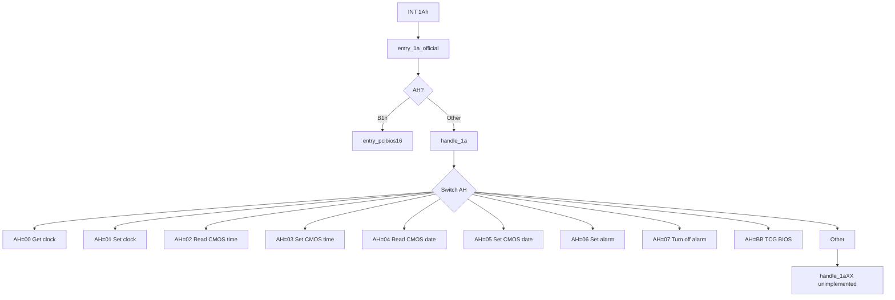

# RTC and Timer Services (INT 1Ah)

This page documents the BIOS Time-of-Day and Real Time Clock services implemented in SeaBIOS and invoked via **INT 1Ah**. It lists every supported function (AH code), its purpose, register inputs and outputs, and how the handler uses the BDA and MC146818-compatible CMOS/RTC registers.

Implementation is in [`src/clock.c`](src/clock.c) (handler and dispatch), [`src/hw/rtc.c`](src/hw/rtc.c), [`src/hw/rtc.h`](src/hw/rtc.h), and [`src/hw/timer.c`](src/hw/timer.c). The IVT vector 0x1A is set in [`src/post.c`](src/post.c) to `entry_1a_official`. When AH=B1h, control is routed to the PCI BIOS in [`src/pcibios.c`](src/pcibios.c).

## Overview

- **INT 1Ah** is the Time-of-Day / RTC / Timer service. The entry point `entry_1a_official` in [`src/romlayout.S`](src/romlayout.S) (at 0xfe6e) branches on **AH**: if AH=B1h it jumps to `entry_pcibios16` (PCI BIOS); otherwise it invokes `handle_1a()` in `src/clock.c`, which dispatches on AH.
- **Entry point**: `entry_1a_official` at 0xfe6e (see [Interrupt_Descriptor_Table.md](Interrupt_Descriptor_Table.md)); IVT vector 0x1A is set in `ivt_init()` in `src/post.c`.
- **Success/error convention**: On return, the **carry flag (CF)** is clear on success and set on error (invalid, unimplemented, or RTC update in progress). For functions that set an error code, **AH** holds the code (e.g. PCI BIOS return codes).

## Calling conventions

- **Register layout** matches `struct bregs` in `src/bregs.h` (DS, ES, EDI/DI, ESI/SI, EBP/BP, EBX/BX, EDX/DX, ECX/CX, EAX/AX, and flags).
- **Function code**: **AH** selects the subfunction. Supported in `handle_1a()`: 00h–07h (RTC/clock), BBh (TCG BIOS when CONFIG_TCGBIOS). AH=B1h is handled by the PCI BIOS (see [`src/pcibios.c`](src/pcibios.c)).

## Implementation flow

## BIOS Data Area (timer and RTC)

Timer- and RTC-related BDA fields are documented in [BIOS_Data_Area.md](BIOS_Data_Area.md). Key locations:

| BDA offset | Field | Description |
|------------|--------|-------------|
| 0x6C | timer_counter | Tick count at ~18.2 Hz; rolls over at TICKS_PER_DAY (1573040). INT 1Ah AH=00h/01h get/set. |
| 0x70 | timer_rollover | Incremented at midnight when timer_counter rolls over; AH=00h returns and clears it. |
| 0x98 | user_wait_complete_flag | Used by INT 15h AH=83h (not INT 1A). |
| 0x9C | user_wait_timeout | Used by INT 15h AH=83h (not INT 1A). |
| 0xA0 | rtc_wait_flag | RWS_WAIT_PENDING for RTC-based interval wait (INT 15h AH=83h). |

- **Initialization**: `clock_setup()` in `src/clock.c` sets `timer_counter` from the RTC (hours, minutes, seconds) and clears `timer_rollover`. INT 08h increments `timer_counter` each tick and increments `timer_rollover` at midnight.

## CMOS/RTC registers

The RTC is MC146818-compatible, accessed via I/O ports 0x70 (index) and 0x71 (data). Definitions are in [`src/hw/rtc.h`](src/hw/rtc.h):

| Index | Name | Purpose |
|-------|------|---------|
| 0x00 | CMOS_RTC_SECONDS | Seconds (BCD) |
| 0x01 | CMOS_RTC_SECONDS_ALARM | Alarm seconds |
| 0x02 | CMOS_RTC_MINUTES | Minutes (BCD) |
| 0x03 | CMOS_RTC_MINUTES_ALARM | Alarm minutes |
| 0x04 | CMOS_RTC_HOURS | Hours (BCD) |
| 0x05 | CMOS_RTC_HOURS_ALARM | Alarm hours |
| 0x06 | CMOS_RTC_DAY_WEEK | Day of week |
| 0x07 | CMOS_RTC_DAY_MONTH | Day of month (BCD) |
| 0x08 | CMOS_RTC_MONTH | Month (BCD) |
| 0x09 | CMOS_RTC_YEAR | Year (BCD) |
| 0x0A | CMOS_STATUS_A | Update-in-progress (UIP) bit |
| 0x0B | CMOS_STATUS_B | DSE, 24HR, AIE, PIE, SET, etc. |
| 0x0C | CMOS_STATUS_C | Interrupt flags |
| 0x32 | CMOS_CENTURY | Century (e.g. QEMU) |

Status B bits used: RTC_B_SET (halt), RTC_B_PIE (periodic interrupt), RTC_B_AIE (alarm interrupt), RTC_B_24HR (24-hour mode), RTC_B_DSE (daylight saving enable).

---

## Supported functions summary

| AH | Function | Purpose |
|----|----------|---------|
| 00h | Read system clock count | Return tick count and rollover flag |
| 01h | Set system clock count | Set tick count and clear rollover |
| 02h | Read CMOS time | Get time from RTC (BCD) |
| 03h | Set CMOS time | Set RTC time (BCD) |
| 04h | Read CMOS date | Get date from RTC (BCD) |
| 05h | Set CMOS date | Set RTC date (BCD) |
| 06h | Set alarm time | Set RTC alarm and enable alarm interrupt |
| 07h | Turn off alarm | Disable RTC alarm interrupt |
| BBh | TCG BIOS extension | TPM/TCG interface (when CONFIG_TCGBIOS) |
| B1h | PCI BIOS extension | PCI configuration (routed to pcibios.c when CONFIG_PCIBIOS) |

Any other AH value invokes `handle_1aXX()` and returns **unimplemented** (CF=1).

---

### AH=00h — Read system clock count

- **Purpose**: Return the current BIOS tick count and the midnight rollover flag. The tick count runs at approximately 18.2 Hz and rolls over at TICKS_PER_DAY (1573040).
- **Inputs**: None.
- **Outputs**: **CX:DX** = 32-bit tick count (high word in CX, low in DX). **AL** = value of `timer_rollover` (then cleared). CF=0.
- **Implementation**: `handle_1a00()`. Calls `yield()`, reads BDA `timer_counter` and `timer_rollover`, clears `timer_rollover`, sets success.

---

### AH=01h — Set system clock count

- **Purpose**: Set the BIOS tick count and clear the rollover flag.
- **Inputs**: **CX:DX** = new 32-bit tick count (CX = high word, DX = low word).
- **Outputs**: AH=0; CF=0.
- **Implementation**: `handle_1a01()`. Writes (CX << 16) | DX to BDA `timer_counter` and clears `timer_rollover`.

---

### AH=02h — Read CMOS time

- **Purpose**: Read the current time from the RTC in BCD format.
- **Inputs**: None.
- **Outputs**: **CH** = hours, **CL** = minutes, **DH** = seconds (BCD). **DL** bit 0 = daylight saving enable (DSE) from Status B. **AL** = CH (hours). CF=0. If the RTC update-in-progress (UIP) bit is set, the handler returns with CF=1 (invalid).
- **Implementation**: `handle_1a02()`. If `rtc_updating()` returns true, calls `set_invalid(regs)` and returns. Otherwise reads CMOS seconds, minutes, hours, and Status B (for DSE).

---

### AH=03h — Set CMOS time

- **Purpose**: Set the RTC time in BCD. Also updates Status B for 24-hour mode and daylight saving.
- **Inputs**: **CH** = hours, **CL** = minutes, **DH** = seconds (BCD). **DL** bit 0 = DSE (daylight saving enable).
- **Outputs**: AH=0; **AL** = value last written to CMOS Status B. CF=0.
- **Implementation**: `handle_1a03()`. If RTC is updating, calls `rtc_setup()` then continues. Writes DH, CL, CH to CMOS seconds, minutes, hours. Writes Status B with (existing PIE/AIE preserved) RTC_B_24HR and (DL & RTC_B_DSE).

---

### AH=04h — Read CMOS date

- **Purpose**: Read the current date from the RTC in BCD format.
- **Inputs**: None.
- **Outputs**: **CH** = century (from `Century` variable), **CL** = year, **DH** = month, **DL** = day of month (BCD). **AL** = CH. CF=0. If RTC is updating, CF=1 (invalid).
- **Implementation**: `handle_1a04()`. If `rtc_updating()` returns true, returns invalid. Reads CMOS year, month, day of month and the low-memory `Century` variable.

---

### AH=05h — Set CMOS date

- **Purpose**: Set the RTC date in BCD and update the Century storage. Clears the halt (SET) bit in Status B.
- **Inputs**: **CH** = century, **CL** = year, **DH** = month, **DL** = day of month (BCD).
- **Outputs**: AH=0; **AL** = value last written to Status B. CF=0. If RTC is updating, the handler calls `rtc_setup()` then returns with CF=1 (invalid).
- **Implementation**: `handle_1a05()`. Writes CL, DH, DL to CMOS year, month, day. Sets `Century` from CH. Clears RTC_B_SET in Status B.

---

### AH=06h — Set alarm time

- **Purpose**: Set the RTC alarm registers and enable the alarm interrupt (RTC_B_AIE in Status B).
- **Inputs**: **CH** = alarm hours, **CL** = alarm minutes, **DH** = alarm seconds (BCD).
- **Outputs**: CF=0 on success. CF=1 if the alarm interrupt is already enabled (RTC_B_AIE set) or if invalid. On success, AX=0.
- **Implementation**: `handle_1a06()`. If Status B has RTC_B_AIE set, returns invalid. If RTC is updating, calls `rtc_setup()` then continues. Writes DH, CL, CH to alarm seconds, minutes, hours. Writes Status B with (val8 & ~RTC_B_SET) | RTC_B_AIE.

---

### AH=07h — Turn off alarm

- **Purpose**: Disable the RTC alarm interrupt and clear the halt bit in Status B.
- **Inputs**: None.
- **Outputs**: AH=0; **AL** = previous Status B value. CF=0.
- **Implementation**: `handle_1a07()`. Reads Status B, then writes Status B with (val8 & ~(RTC_B_SET|RTC_B_AIE)).

---

### AH=BBh — TCG BIOS extension

- **Purpose**: TPM/TCG BIOS interface per the PC Client Work Group Specification. Subfunction is in **AL** (e.g. TCG_StatusCheck, TCG_HashLogExtendEvent, TCG_PassThroughToTPM, etc.).
- **Inputs**: **AL** = TCG subfunction (irq_ids). Other inputs depend on subfunction; see [`src/tcgbios.c`](src/tcgbios.c) and `tpm_interrupt_handler32()`.
- **Outputs**: Depends on subfunction; **CF** indicates success (0) or failure (1). **EAX** and other registers hold subfunction-specific results.
- **Implementation**: `handle_1abb()`. If CONFIG_TCGBIOS is not set, returns without changing registers. Otherwise calls `tpm_interrupt_handler32(regs)` via `call32()`.
- **Config**: Requires **CONFIG_TCGBIOS**.

---

### AH=B1h — PCI BIOS extension

- **Purpose**: PCI BIOS interface (Configuration Mechanism #1). Dispatched from `entry_1a_official` before `handle_1a()`; implemented in [`src/pcibios.c`](src/pcibios.c).
- **Inputs**: **AL** = subfunction. Supported: 01h (installation check), 02h (find PCI device), 03h (find by class), 08h–0Dh (read/write config byte/word/dword), 0Eh (get IRQ routing options).
- **Outputs**: AH=0, CF=0 on success. On failure, AH = error code (e.g. 0x81 unsupported, 0x86 device not found, 0x89 buffer too small), CF=1.
- **Implementation**: `entry_pcibios16` → `handle_1ab1()`. When CONFIG_PCIBIOS is disabled, returns invalid (CF=1).
- **Config**: Requires **CONFIG_PCIBIOS**.

---

## Unsupported functions

For any **AH** not listed above (and not B1h, which is handled by the PCI BIOS entry), `handle_1a()` calls `handle_1aXX()`, which invokes `set_unimplemented(regs)`. This sets **CF=1**. No specific AH error code is defined for unimplemented INT 1Ah functions.

---

## Configuration

| Config | Effect |
|--------|--------|
| CONFIG_RTC_TIMER | Enables RTC periodic interrupt (IRQ 8); affects alarm and RTC time/date behavior. When disabled, `rtc_setup()`/`rtc_use()`/`rtc_release()` are no-ops. |
| CONFIG_TCGBIOS | Enables AH=BBh TCG BIOS handler. When disabled, AH=BBh returns without action. |
| CONFIG_PCIBIOS | Enables AH=B1h PCI BIOS handler. When disabled, AH=B1h returns invalid. |

---

## Related documentation

- [BIOS_Data_Area.md](BIOS_Data_Area.md) — `timer_counter`, `timer_rollover`, `rtc_wait_flag`, `user_wait_complete_flag`, `user_wait_timeout`.
- [Interrupt_Descriptor_Table.md](Interrupt_Descriptor_Table.md) — Vector 0x1A and entry point `entry_1a_official`.
- [Int15_System_Services.md](Int15_System_Services.md) — AH=83h and AH=86h use the RTC for user wait and block for a specified time.
