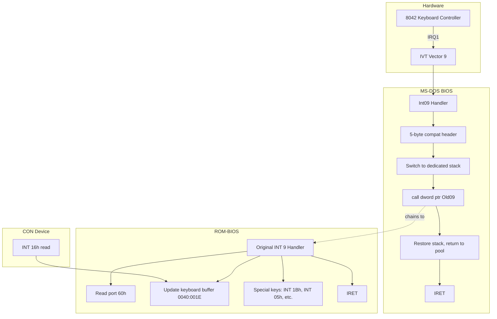

# Keyboard Interrupt (IRQ1, Vector 9)

This document describes how the Keyboard Interrupt (IRQ1, vector 9) is processed in MS-DOS 3.30, how the MS-DOS BIOS interacts with it, and how it cooperates with BIOS functions. It is based on the BIOS and SYSINIT source in this repository.

---

## 1. Overview

The Keyboard Interrupt in MS-DOS 3.30 is **not** fully implemented in the MS-DOS source. The primary handler lives in **ROM-BIOS**. MS-DOS hooks INT 9 only to provide **stack switching** for nested interrupts; it does not add keyboard logic. All keyboard input is read by the CON device driver via **INT 16h** (the ROM-BIOS keyboard interface). Ctrl+Break is handled by an **INT 1Bh** handler installed by MS-DOS.

- **IRQ1** – hardware keyboard interrupt from the 8042 keyboard controller
- **Vector 9** – interrupt vector 9 in the x86 IVT
- **ROM-BIOS** – reads scan codes from port 60h, maintains keyboard buffer at 0040:001Eh

---

## 2. Hardware and Architecture

- **IRQ1** is generated by the 8042 keyboard controller when a key is pressed or released.
- **Vector 9** in the x86 Interrupt Vector Table (IVT) at address `0:24h`–`0:27h` (4 bytes: offset, segment).
- The ROM-BIOS INT 9 handler reads the scan code from I/O port **60h**.
- **Keyboard buffer**: 32-byte circular buffer in the BIOS data area at `0040:001Eh`; head pointer at `0040:001Ah`, tail pointer at `0040:001Ch`.
- **Keyboard state flags**: at `0040:0017h` and `0040:0018h` (shift/alt/ctrl, etc.).

MS-DOS does not access these ports or buffers directly; the CON device driver uses INT 16h to read characters that the ROM-BIOS has already placed in the buffer.

---

## 3. ROM-BIOS INT 9 Handler

The actual keyboard interrupt handler is in ROM-BIOS; it is not part of the MS-DOS source. Typically it:

1. Reads the scan code from port 60h.
2. Updates keyboard state flags (shift, Ctrl, Alt, etc.) at 0040:0017h/0018h.
3. Translates scan codes to ASCII/scan code pairs and stores them in the keyboard buffer at 0040:001Eh.
4. Handles special keys:
   - **Ctrl+Break** – invokes **INT 1Bh** (MS-DOS installs `CBREAK` here).
   - **Print Screen** – invokes INT 05h.
   - **Ctrl+Alt+Del** – transfers to ROM bootstrap (reboot).
   - **Ctrl+NumLock / Pause** – enters a wait loop.
5. On AT-class machines, the BIOS feature byte may indicate that the keyboard interrupt calls **INT 15h** (keyboard escape sequence) for certain keys; see [SRC/BIOS/BIOSTRUC.INC](SRC/BIOS/BIOSTRUC.INC) (feature byte 1, bit 4: KeyEscapeSeq).
6. Sends **EOI** to the 8259 PIC and returns.

MS-DOS does **not** replace this handler; it chains to it after performing stack switching.

---

## 4. MS-DOS INT 9 Hook: Stack Switching

MS-DOS hooks INT 9 during initialization so that each keyboard interrupt runs on a dedicated stack. This avoids stack overflow when interrupts nest (e.g. keyboard firing during another interrupt).

### 4.1 Where It Is Installed

- **Stack initialization**: [SRC/BIOS/STKINIT.INC](SRC/BIOS/STKINIT.INC) – `StackInit` procedure, in the same loop as vectors 02, 08, and 70.
- **Handler definition**: [SRC/BIOS/MSSTACK.INC](SRC/BIOS/MSSTACK.INC) – `Stack_Main` macro for vector 09 (generates `Int09`).
- **Invoked from**: [SRC/BIOS/SYSINIT1.ASM](SRC/BIOS/SYSINIT1.ASM) – `CALL StackInit` during SYSINIT.

From [SRC/BIOS/STKINIT.INC](SRC/BIOS/STKINIT.INC) lines 155–162:

```text
	IRP	AA,<02,08,09,70>
	MOV	SI,AA&H*4		; ... vector to be adjusted
	mov	di, offset Int19OLD&AA
	MOV	BX,OFFSET OLD&AA
	MOV	DX,OFFSET INT&AA
	CALL	NEW_INIT_LOOP
	ENDM
```

### 4.2 Special Requirement: 5-Byte Header

The keyboard interrupt handler must have a specific first instruction for **compatibility** with software that patches or inspects the INT 9 vector. From [SRC/BIOS/MSSTACK.INC](SRC/BIOS/MSSTACK.INC) lines 92–99:

```text
; Keyboard interrupt must have a three byte jump, a NOP and a zero byte
; as its first instruction for compatibility reasons
	ifidn	<&aa>,<09>
	jmp	Keyboard_lbl
	nop
	db	0
Keyboard_lbl	label	near
	endif
```

So the first 5 bytes of Int09 are: a 3-byte short jump, NOP, and a zero byte.

### 4.3 Processing Flow



### 4.4 Int09 Handler Logic (MSSTACK.INC)

The Int09 handler generated by `Stack_Main` in [SRC/BIOS/MSSTACK.INC](SRC/BIOS/MSSTACK.INC):

- For vector 09 only, begins with the 5-byte compatibility header (jmp, nop, 0).
- Saves the original INT 9 vector in `Old09` and in `Int19OLD09` (for INT 19 restore).
- Allocates a stack from the pool (`NextEntry`, `AllocByte`).
- Switches `SS:SP` to the new stack.
- Calls the original ROM handler with `call dword ptr Old09` (with flags pushed so the ROM handler returns to the MS-DOS wrapper).
- Restores the previous stack and returns the entry to the pool.
- Returns with `IRET`.

### 4.5 Restore on Reboot

On INT 19 (reboot), [SRC/BIOS/MSBIO2.ASM](SRC/BIOS/MSBIO2.ASM) restores all hooked vectors, including INT 9, from `Int19OLD09` (and the other `Int19OLDxx` variables) before invoking the ROM bootstrap. This ensures the ROM sees its original vectors when it runs again.

---

## 5. INT 1Bh – Break Key Handler

When the user presses **Ctrl+Break**, the ROM-BIOS INT 9 handler invokes **INT 1Bh**. MS-DOS installs its own handler so that the CON device and DOS can respond to Break.

- **Vector**: 1Bh (IVT address `0:6Ch`–`0:6Fh`).
- **Defined in**: [SRC/BIOS/MSEQU.INC](SRC/BIOS/MSEQU.INC) – `BRKADR = 1BH * 4`.
- **Installation**: [SRC/BIOS/MSINIT.ASM](SRC/BIOS/MSINIT.ASM) lines 482–483 during INIT:

```text
	mov	DS:WORD PTR BRKADR,OFFSET CBREAK    ;BREAK ENTRY POINT
	mov	DS:BRKADR+2,AX		;VECTOR FOR BREAK
```

- **CBREAK** in [SRC/BIOS/MSCON.ASM](SRC/BIOS/MSCON.ASM) lines 205–208:

```text
Public CBREAK
CBREAK:
	mov	CS:ALTAH, 3		; indicate break key set
```

So the INT 1Bh handler only sets **ALTAH** to 3. The CON device driver uses **ALTAH** as a one-byte “holding” buffer for a pending extended key or for the break indication. When the application reads from the console, the driver can return or signal that Break was pressed (ALTAH = 3).

---

## 6. INT 16h – ROM-BIOS Keyboard Interface

MS-DOS uses **INT 16h** for all keyboard input. The CON device driver never hooks INT 9 or reads port 60h; it relies entirely on the ROM-BIOS keyboard buffer and INT 16h.

### 6.1 Functions Used by CON

| AH | Function | Used In |
|----|----------|---------|
| 0 | Read character (wait); returns AL = ASCII, AH = scan code | CHRIN, CON$READ |
| 1 | Check keyboard status; ZF=1 if no character, ZF=0 and AX=char if available | CON$RDND, CON$FLSH |

### 6.2 Usage in MS-DOS

- **[SRC/BIOS/MSCON.ASM](SRC/BIOS/MSCON.ASM)**:
  - **CHRIN** (lines 56–76): INT 16h AH=0 to read one character; checks ALTAH first for a pending extended key or break.
  - **CON$RDND** (lines 94–149): INT 16h AH=1 to see if a character is available; if not and System WAIT is enabled on a K09, uses INT 15h AH=41h (Wait on External Event).
  - **CON$FLSH** (lines 163–178): Clears ALTAH, then INT 16h AH=1 / AH=0 in a loop to drain the keyboard buffer.

---

## 7. CON Device Driver and Keyboard

The console (CON) device is the only driver in the MS-DOS BIOS that reads the keyboard. It does so exclusively via INT 16h and the ALTAH byte.

- **CON$READ** (command 4): Calls **CHRIN** in a loop; CHRIN uses INT 16h AH=0 (and ALTAH for extended/break).
- **CON$RDND** (command 5, non-destructive read no wait): Uses INT 16h AH=1. If no character and the request has the System WAIT bit set and **fHaveK09** is set, it issues INT 15h AH=41h (Wait on External Event) so the system can suspend (e.g. K09 laptop) and resume with a keypress.
- **CON$FLSH** (command 7): Sets ALTAH to 0 and flushes the ROM keyboard buffer using INT 16h.
- **ALTAH**: Single-byte buffer in [SRC/BIOS/MSDATA.INC](SRC/BIOS/MSDATA.INC) (lines 828–832). Holds either the AH (scan code) of an extended key that was read first, or the value 3 to indicate Ctrl+Break. CON uses it so that a two-byte key (e.g. function key) or break is delivered correctly on the next read.

---

## 8. K09 and INT 15h

The **K09** (IBM Convertible and similar) is a laptop platform that supports suspend/resume. The BIOS reports it via INT 15h.

- **fHaveK09**: Flag in [SRC/BIOS/MSDATA.INC](SRC/BIOS/MSDATA.INC) (lines 325–326). Set to 1 in [SRC/BIOS/MSINIT.ASM](SRC/BIOS/MSINIT.ASM) in the **CheckK09** block when INT 15h AH=41h (AX=4100h) indicates a K09-type machine.
- When **fHaveK09** is set, **CON$RDND** uses **INT 15h AH=41h** (Wait on External Event) when there is no character and the driver is in System WAIT mode, so the machine can suspend and resume on keypress.
- [SRC/BIOS/MSINIT.ASM](SRC/BIOS/MSINIT.ASM) also installs an **INT 6Ch** handler (K09 suspend/resume support) when a K09 is detected; that code is copied from the INT6C/ENDK09 range.

---

## 9. INT 19 Restore

On INT 19 (reboot), [SRC/BIOS/MSBIO2.ASM](SRC/BIOS/MSBIO2.ASM) restores all hardware interrupt vectors that were hooked by the stack code, including INT 9, from the `Int19OLDxx` variables (e.g. `Int19OLD09`) before invoking the ROM bootstrap. So after reboot, the ROM’s INT 9 vector is restored and the ROM runs with its original handlers.

---

## 10. References

| Topic | File | Lines / Notes |
|-------|------|----------------|
| Int09 handler, 5-byte header | [SRC/BIOS/MSSTACK.INC](SRC/BIOS/MSSTACK.INC) | 92–99, 231–234 |
| Stack init, INT 9 hook | [SRC/BIOS/STKINIT.INC](SRC/BIOS/STKINIT.INC) | 155–162 |
| INT 1Bh (BRKADR), CBREAK install | [SRC/BIOS/MSINIT.ASM](SRC/BIOS/MSINIT.ASM) | 482–483 |
| CBREAK, CON keyboard routines | [SRC/BIOS/MSCON.ASM](SRC/BIOS/MSCON.ASM) | 56–76, 94–149, 163–178, 205–208 |
| INT 19 restore | [SRC/BIOS/MSBIO2.ASM](SRC/BIOS/MSBIO2.ASM) | 251–265 |
| fHaveK09, ALTAH | [SRC/BIOS/MSDATA.INC](SRC/BIOS/MSDATA.INC) | 325–326, 828–832 |
| INT 15h keyboard escape (feature byte) | [SRC/BIOS/BIOSTRUC.INC](SRC/BIOS/BIOSTRUC.INC) | 57–62 |
| BRKADR equate | [SRC/BIOS/MSEQU.INC](SRC/BIOS/MSEQU.INC) | 29 |
| K09 detection, INT 6Ch | [SRC/BIOS/MSINIT.ASM](SRC/BIOS/MSINIT.ASM) | 1094–1124 |
