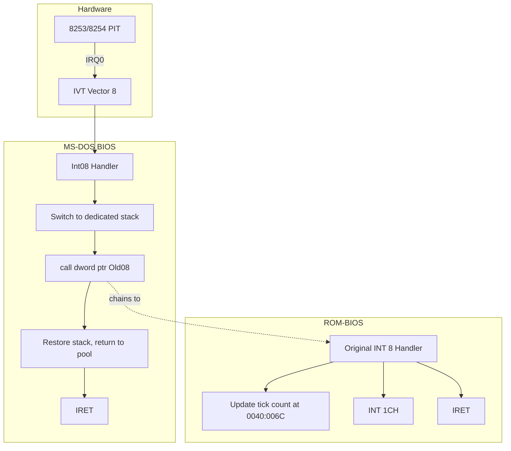

# Timer Interrupt (IRQ0, Vector 8)

This document describes how the Timer Interrupt (IRQ0, vector 8) is processed in MS-DOS 3.30, how the MS-DOS BIOS interacts with it, and how it cooperates with BIOS functions. It is based on the BIOS and SYSINIT source in this repository.

---

## 1. Overview

The Timer Interrupt in MS-DOS 3.30 is **not** fully implemented in the MS-DOS source. The primary handler lives in **ROM-BIOS**. MS-DOS hooks INT 8 only to provide **stack switching** for nested interrupts; it does not add timer logic. All clock and time operations use **INT 1AH** (the ROM-BIOS clock interface).

- **IRQ0** – hardware timer interrupt from the 8253/8254 PIT
- **Vector 8** – interrupt vector 8 in the x86 IVT
- **Rate** – approximately **18.2 ticks per second** (~54.9 ms per tick)

---

## 2. Hardware and Architecture

- **IRQ0** is generated by the 8253/8254 Programmable Interval Timer (PIT).
- **Vector 8** in the x86 Interrupt Vector Table (IVT) at address `0:20h`–`0:23h` (4 bytes: offset, segment).
- **Tick rate**: 1193180/65536 ≈ 18.2 ticks per second.

Source: [SRC/BIOS/MSCLOCK.ASM](SRC/BIOS/MSCLOCK.ASM) lines 17–20:

```text
; The clock ticks at the rate of:
; 1193180/65536 ticks/second (about 18.2 ticks per second)
```

---

## 3. ROM-BIOS INT 8 Handler

The actual timer interrupt handler is in ROM-BIOS; it is not part of the MS-DOS source. Typically it:

1. Updates the BIOS tick counter at `0040:006Ch` (low word) and `0040:006Eh` (high word).
2. Handles midnight rollover (e.g. incrementing day count or setting a flag).
3. Sends **EOI** (End Of Interrupt) to the 8259 PIC at port 20h.
4. Executes **INT 1CH** at the end so that software can hook the timer tick without replacing the whole INT 8 handler.

MS-DOS does **not** replace this handler; it chains to it after performing stack switching.

---

## 4. MS-DOS INT 8 Hook: Stack Switching

MS-DOS hooks INT 8 during initialization so that each timer interrupt runs on a dedicated stack. This avoids stack overflow when interrupts nest (e.g. timer firing during another interrupt).

### 4.1 Where It Is Installed

- **Stack initialization**: [SRC/BIOS/STKINIT.INC](SRC/BIOS/STKINIT.INC) – `StackInit` procedure.
- **Handler definition**: [SRC/BIOS/MSSTACK.INC](SRC/BIOS/MSSTACK.INC) – `Stack_Main` macro for vector 08.
- **Invoked from**: [SRC/BIOS/SYSINIT1.ASM](SRC/BIOS/SYSINIT1.ASM) – `CALL StackInit` during SYSINIT.

### 4.2 Processing Flow



### 4.3 Int08 Handler Logic (MSSTACK.INC)

The Int08 handler generated by `Stack_Main` in [SRC/BIOS/MSSTACK.INC](SRC/BIOS/MSSTACK.INC):

- Saves the original INT 8 vector in `Old08` and in `Int19OLD08` (for INT 19 restore).
- Allocates a stack from the pool (`NextEntry`, `AllocByte`).
- Switches `SS:SP` to the new stack.
- Calls the original ROM handler with `call dword ptr Old08` (with flags pushed so the ROM handler returns to the MS-DOS wrapper).
- Restores the previous stack and returns the entry to the pool.
- Returns with `IRET`.

### 4.4 Restore on Reboot

On INT 19 (reboot), [SRC/BIOS/MSBIO2.ASM](SRC/BIOS/MSBIO2.ASM) restores all hooked vectors, including INT 8, from `Int19OLD08` (and the other `Int19OLDxx` variables) before invoking the ROM bootstrap. This ensures the ROM sees its original vectors when it runs again.

---

## 5. INT 1CH (Timer Tick Software Hook)

- **Vector**: 1CH (IVT address `0:70h`).
- **Defined in**: [SRC/BIOS/MSEQU.INC](SRC/BIOS/MSEQU.INC) – `TIMADR = 1CH * 4`.
- **Called by**: The ROM-BIOS INT 8 handler at the end of each timer tick.

INT 1CH is the standard hook for “user” code that wants to run every tick. MS-DOS **does not** install an INT 1CH handler. From [SRC/BIOS/MSBIO1.ASM](SRC/BIOS/MSBIO1.ASM) (REV 2.15):

> "Because of IBM design issues, and that BASCOM is ill behaved with respect to the 1CH timer interrupt, the timer handler has to be backed out!"

The intended INT 1CH hook in the BIOS was removed for compatibility; the ROM’s INT 1CH vector is left as-is (often a simple IRET).

---

## 6. INT 1AH – ROM-BIOS Clock Interface

MS-DOS uses **INT 1AH** for all clock and time operations instead of hooking the timer interrupt or INT 1CH for timekeeping.

### 6.1 Functions Used

| AH | Function | Used By |
|----|----------|---------|
| 0 | Read clock (CX:DX = tick count, AL = midnight rollover flag) | MSCLOCK, MSDISK, READCLOC |
| 1 | Set clock | MSCLOCK |
| 2 | Read RTC time | READCLOC (CMOS) |
| 3 | Set RTC time | MSCLOCK |
| 4 | Read RTC date | READCLOC |
| 5 | Set RTC date | MSCLOCK |

### 6.2 Usage in MS-DOS

- **[SRC/BIOS/MSCLOCK.ASM](SRC/BIOS/MSCLOCK.ASM)**: `TIM$READ`, `TIM$WRIT` – CLOCK$ device driver (read/set system time).
- **[SRC/BIOS/MSDISK.ASM](SRC/BIOS/MSDISK.ASM)**: `CHECK_TIME_OF_ACCESS`, `SET_TIM` – use INT 1AH to decide whether enough time has passed to assume media may have changed.
- **[SRC/BIOS/READCLOC.INC](SRC/BIOS/READCLOC.INC)**: `read_real_date`, `Read_Real_Time` – read date/time from CMOS/RTC via INT 1AH.

---

## 7. PRINT and INT 1CH

The IBM version of PRINT can hook **INT 1CH** for hardware timer mode ([SRC/CMD/PRINT/PRIDEFS.INC](SRC/CMD/PRINT/PRIDEFS.INC)):

- `INTLOC EQU 1CH` – hardware timer interrupt vector used when PRINT is built for timer-based operation.
- PRINT uses timer ticks to continue background printing when the system is busy but not necessarily in DOS I/O wait.
- The MS version uses only INT 28H (DOS idle); the IBM version can use both INT 28H and INT 1CH.

---

## 8. Timer Initialization

- **Turn_Timer_On** in [SRC/BIOS/MSINIT.ASM](SRC/BIOS/MSINIT.ASM) (lines 446–448): sends EOI to port 20h so the timer interrupt can be delivered after boot. This does not program the PIT; it only acknowledges the interrupt controller.
- The 8253/8254 is programmed by ROM-BIOS at POST; MS-DOS does not reprogram it.
- The INT 8 vector is hooked later when **StackInit** runs during SYSINIT ([SRC/BIOS/SYSINIT1.ASM](SRC/BIOS/SYSINIT1.ASM)).

---

## 9. References

| Topic | File | Lines / Notes |
|-------|------|----------------|
| Timer rate | [SRC/BIOS/MSCLOCK.ASM](SRC/BIOS/MSCLOCK.ASM) | 17–20 |
| Stack handler Int08 | [SRC/BIOS/MSSTACK.INC](SRC/BIOS/MSSTACK.INC) | 64–223 (Stack_Main 08) |
| Stack init, INT 8 hook | [SRC/BIOS/STKINIT.INC](SRC/BIOS/STKINIT.INC) | 155–162 |
| INT 19 restore | [SRC/BIOS/MSBIO2.ASM](SRC/BIOS/MSBIO2.ASM) | 251–265 |
| INT 1CH backed out | [SRC/BIOS/MSBIO1.ASM](SRC/BIOS/MSBIO1.ASM) | 126–131 |
| TIMADR (1CH) | [SRC/BIOS/MSEQU.INC](SRC/BIOS/MSEQU.INC) | 30 |
| INT 1AH usage | MSCLOCK.ASM, MSDISK.ASM, READCLOC.INC | various |
| PRINT INT 1CH | [SRC/CMD/PRINT/PRIDEFS.INC](SRC/CMD/PRINT/PRIDEFS.INC) | 85 |
| Turn_Timer_On | [SRC/BIOS/MSINIT.ASM](SRC/BIOS/MSINIT.ASM) | 446–448 |
