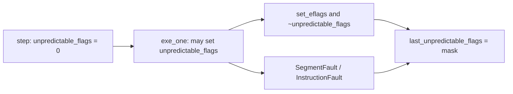

# Unpredictable FLAGS

The Tiltti emulators model **8086 FLAGS** and **386 EFLAGS** and mark certain bits as unpredictable when an instruction's flag behavior cannot be modeled reliably—either per Intel documentation or because real hardware varies. These bits are recorded in an `unpredictable_flags` bitmask during instruction execution.

- **8086** behavior is implemented in [`intel8086.cpp`](../intel8086.cpp).
- **386** behavior is implemented in [`intel386.cpp`](../intel386.cpp).

## Intel 8086

### Instructions with Unpredictable Flags

| Instruction | Opcode(s) | Unpredictable Flags | Explanation |
|-------------|-----------|---------------------|-------------|
| AAA | 0x37 | OF, PF, SF, ZF | Overflow, parity, sign and zero undefined per Intel |
| DAA | 0x27 | OF | Overflow undefined per Intel |
| AAS | 0x3f | OF, PF, SF, ZF | Overflow, parity, sign and zero undefined per Intel |
| DAS | 0x2f | OF | Overflow undefined per Intel |
| AAM | 0xd4 | OF | Overflow undefined per Intel |
| AAD | 0xd5 | OF | Overflow undefined per Intel |
| RCR (count != 1) | D0-D3 reg=3 | OF | OF defined only for single-rotate (count=1); undefined when count != 1 |
| SAL / SHL | D0-D3 reg=4 | AF | AF undefined per Intel; batch5/batch6 expect different values |
| MUL (word) | F7 reg=4 (w=W) | PF, ZF | PF and ZF undefined per Intel for word MUL |
| IMUL | F7 reg=5 | PF, AF, ZF, SF | AF, SF, ZF, PF undefined; only CF and OF defined per Intel |
| DIV | F7 reg=6 | CF, OF, SF, ZF, PF, AF | All arithmetic flags undefined per 8086 documentation |
| IDIV | F7 reg=7 | CF, OF, SF, ZF, PF, AF | Arithmetic flags in undefined state per 8086 manual |

### Usage in the 8086 Emulator

The `unpredictable_flags` bitmask is cleared at the start of each instruction step. When an instruction executes, it may set `unpredictable_flags` to designate which flag bits it leaves undefined. These bits are then masked out when comparing FLAGS for testing (e.g., `core.flags.w &= ~unpredictable_flags`), so tests do not fail on values that the simulator computes but real hardware may set differently. `Processor::u_flags()` returns `unpredictable_flags` directly on 8086.

## Intel 386

### Instructions with Unpredictable Flags

| Instruction | Opcode(s) | Unpredictable Flags | Explanation |
|-------------|-----------|---------------------|-------------|
| AAA | 0x37 | OF, PF, SF, ZF | Same as 8086 |
| DAA | 0x27 | OF | Same as 8086 |
| AAS | 0x3f | OF, PF, SF, ZF | Same as 8086 |
| DAS | 0x2f | OF | Same as 8086 |
| AAM | 0xd4 | OF | Same as 8086; divisor 0 raises INT 0 |
| AAD | 0xd5 | OF | Same as 8086 |
| IMUL r, r/m, imm | 0x69 | AF, PF, SF, ZF | CF and OF defined (overflow) |
| IMUL r, r/m, imm8 | 0x6b | AF, PF, SF, ZF | CF and OF defined |
| IMUL r, r/m | 0F AF | AF, PF, SF, ZF | Two-operand form; CF and OF defined |
| IMUL r/m | F7 reg=5 | AF, PF, SF, ZF | Byte, word, or dword (66h); CF and OF defined |
| MUL r/m8 | F7 reg=4 (w=B) | AF, PF, SF, ZF | Byte MUL; CF and OF defined |
| MUL r/m16 | F7 reg=4 (w=W) | PF, ZF, SF, AF | Word MUL; CF and OF defined |
| MUL r/m32 | F7 reg=4 (o32) | PF, ZF, AF, SF | Dword MUL; CF and OF defined |
| DIV | F7 reg=6 | CF, OF, SF, ZF, PF, AF | All arithmetic flags undefined; DF/IF/TF unchanged |
| IDIV | F7 reg=7 | CF, OF, SF, ZF, PF, AF | Same as DIV |
| BT / BTS / BTR / BTC | 0F A3, AB, B3, BB | OF, SF, AF, PF, ZF | CF = selected bit; other flags undefined |
| BT / BTS / BTR / BTC imm8 | 0F BA /4–/7 | OF, SF, AF, PF, ZF | Bit offset from immediate |
| BSF | 0F BC | (conditional) | See [Conditional and fault variants](#conditional-and-fault-variants) |
| BSR | 0F BD | (conditional) | See [Conditional and fault variants](#conditional-and-fault-variants) |
| SHLD | 0F A4, A5 | AF; OF if count>1 | Count masked mod 32; count=0 leaves flags unchanged |
| SHRD | 0F AC, AD | AF; OF if count>1 | Same pattern as SHLD |
| RCR | C0–C3, D0–D3 reg=3 | OF if count≠1 | OF defined only when count=1 |
| RCL / RCR (CL, effective count=0) | D2/D3 reg=2, 3 | OF | When `(CL & 1Fh)≠0` but `count % (9\|17\|33)==0` |
| ROL (CL, effective count=0) | D2/D3 reg=0 | OF | When `(CL & 1Fh)≠0` but `count % (8\|16\|32)==0` |
| SAL / SHL | C0–C3, D0–D3 reg=4, 6 | AF; see conditions | Byte, word, or dword (66h) |
| SHR | C0–C3, D0–D3 reg=5 | AF; CF if count≥width | |
| SAR | C0–C3, D0–D3 reg=7 | AF | OF defined (=0) when count≥1 |

### Conditional and fault variants

Some assignments depend on operands, shift count, or whether the instruction faults before completing.

| Situation | Instruction | Unpredictable flags | Notes |
|-----------|-------------|---------------------|-------|
| `src == 0` | BSF, BSR | OF, SF, AF, CF | PF is **defined** (=1 on real 386); destination undefined |
| `src != 0` | BSF, BSR | OF, SF, AF, PF, CF | ZF defined (=0) |
| `count > 1` | SHLD, SHRD | OF (in addition to AF) | |
| `count >= operand size` | SAL/SHL | OF, CF (+ AF always) | Result forced to 0 |
| `result == 0` (normal shift) | SAL/SHL | OF, CF (+ AF always) | In addition to AF |
| `count >= operand size` | SHR | AF; CF | AF=1 when result is 0 |
| Divide by zero | DIV, IDIV | *(none for comparison)* | `unpredictable_flags` cleared; `last_unpredictable_flags` kept for `u_flags()` |
| Quotient overflow | DIV, IDIV | CF, OF, SF, ZF, PF, AF | Before `#DE` (INT 0) |
| IDIV quotient overflow (byte/word) | IDIV | Above; high byte of pushed flags | `last_unpredictable_flags \| 0xFF00` on some paths |
| Segment fault on MUL memory operand | MUL (F7 /4) | AF, PF, ZF, SF | Set before `#GP`; matches normal MUL completion masking |

### Differences from 8086

- **New instructions**: BT family (0F A3/AB/B3/BB, 0F BA), BSF/BSR (0F BC/BD), SHLD/SHRD (0F A4/A5/AC/AD), three-operand IMUL (69, 6B, 0F AF), and 32-bit MUL/IMUL/DIV/IDIV via operand-size override (66h).
- **MUL byte**: 386 masks AF, PF, SF, ZF; the 8086 table documents only word MUL for PF/ZF.
- **SAL/SHL**: 386 also marks OF and CF unpredictable when `count >= operand size` or when the result is 0; 8086 documents only AF.
- **SHR**: 386 always marks AF unpredictable; CF when `count >= operand size`.
- **BSF/BSR**: Operand size 16 or 32 bits; behavior split when source is 0 (PF defined on hardware).
- **Tests**: 386 uses 32-bit `get_eflags()` and `EXPECT_FLAGS` in [`tests/test386.h`](../tests/test386.h), masking via `cpu.u_flags()` which returns `last_unpredictable_flags`.

### Usage in the 386 Emulator

At the start of `step()`, `unpredictable_flags` is cleared. During `exe_one()`, instructions set bits in `unpredictable_flags` per the tables above. At the end of the step (normal completion or after `#GP` / `#SS` / `#UD`):

1. Architectural EFLAGS have unpredictable bits cleared: `set_eflags(get_eflags() & ~unpredictable_flags)`.
2. If any bits were marked unpredictable, `last_unpredictable_flags` is updated so `Processor::u_flags()` can expose them to tests on the **next** comparison.



386 unit tests use:

```cpp
#define EXPECT_FLAGS(val) \
    EXPECT_EQ(cpu.get_eflags() & ~cpu.u_flags(), val & ~cpu.u_flags())
```

DIV/IDIV fault paths are special: on divide-by-zero the mask is cleared for the faulting step but `last_unpredictable_flags` retains the pre-fault mask so MOO captures still compare correctly.

## Flag Abbreviations

- OF: Overflow
- PF: Parity
- SF: Sign
- ZF: Zero
- CF: Carry
- AF: Auxiliary Carry
