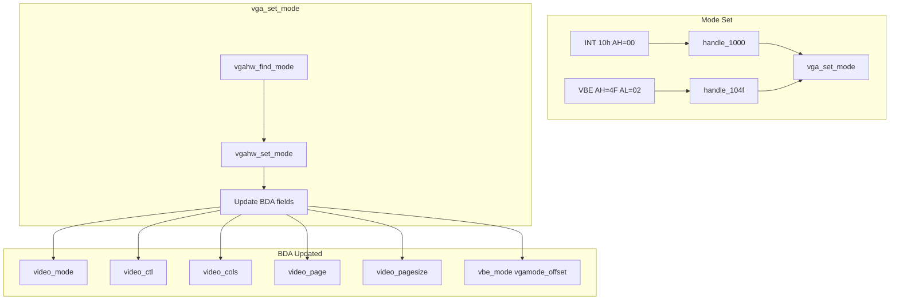

# Video Modes

This page documents how video modes are implemented in SeaBIOS and how BDA (BIOS Data Area) fields participate in the video subsystem. For INT 10h service details, see [Int10_Video_Services.md](Int10_Video_Services.md). For BDA layout, see [BIOS_Data_Area.md](BIOS_Data_Area.md).

## Overview

Video mode implementation involves:

- **Mode tables** (e.g. `vgasrc/stdvgamodes.c`, `vgasrc/svgamodes.c`) that define `struct vgamode_s` entries
- **vga_set_mode()** in `vgasrc/vgabios.c`, which programs hardware and updates BDA
- **BDA video fields** (0x49–0x8A) that describe current mode, dimensions, page, and cursor state
- **Custom VGA BDA** at offset 0xB9 holding VBE mode and pointer to current mode descriptor

Key source files: `vgasrc/vgabios.c`, `vgasrc/vgafb.c`, `vgasrc/vgainit.c`, `src/std/bda.h`.

---

## BDA Video Fields (Core Four)

### video_mode (BDA 0x49, u8)

Current video mode number.

| Value range | Meaning |
|-------------|---------|
| 0x00–0x13   | Standard VGA mode |
| 0xFF        | VBE mode (actual mode in custom BDA `vbe_mode`) |

- **Set by**: `vga_set_mode()` ([vgabios.c](vgasrc/vgabios.c) lines 279–281), `sercon_setup()` when using serial console
- **Read by**: INT 10h AH=0Fh (`handle_100f`), which returns `video_mode | (video_ctl & 0x80)` in AL (bit 7 = "don't clear memory on mode set")
- **Flow**: `handle_1000` or VBE set-mode → `vga_set_mode()` → `vgahw_find_mode()` → `vgahw_set_mode()` → BDA update

### video_ctl (BDA 0x87, u8)

Video control flags.

| Bit | Meaning |
|-----|---------|
| 0   | Cursor enable. 0 = emulate cursor in graphics modes; 1 = use hardware cursor |
| 7   | MF_NOCLEARMEM — do not clear display memory on mode set |

- **Set by**: `vga_set_mode()` → `0x60 | (flags & MF_NOCLEARMEM ? 0x80 : 0x00)`; INT 10h AH=12h BL=34h (cursor emulation)
- **Read by**: `get_cursor_shape()` (cursor emulation), `handle_100f` (bit 7 merged into AL), `handle_101231` (default palette)
- **Usage**: Cursor emulation in graphics modes when bit 0 is 0: `emulate_cursor = (video_ctl & 1) == 0`

### video_cols (BDA 0x4A, u16)

Number of columns (character width). In text modes equals pixel width; in graphics modes equals `width / cwidth`.

- **Set by**: `vga_set_mode()` from `vmode_g->width` (text) or `width / cwidth` (graphics)
- **Read by**: `text_address()`, `write_char()`, `verify_scroll()`, `gfx_write_char()`, `gfx_read_char()`, `swcursor.c`, `sercon.c`, INT 10h AH=0Fh (returns in AH)
- **Critical for**: Stride = `video_cols * 2` in text mode; wrap/scroll bounds; character addressing

### video_page (BDA 0x62, u8)

Active display page (0–7).

- **Set by**: `vga_set_mode()` (0); `set_active_page()` (INT 10h AH=05h)
- **Read by**: `get_cursor_pos()`, `handle_100e` (teletype uses current page), `verify_scroll()`, `handle_100f`, `swcursor.c`
- **Relation**: `video_pagestart` holds the offset of this page in video memory; `text_address()` uses `video_pagesize * page`

---

## Related BDA Video Fields

| Field | Offset | Description |
|-------|--------|-------------|
| video_pagesize | 0x4C | Size of one page in bytes. Set via `calc_page_size()`; used by `text_address()` for page offset |
| video_pagestart | 0x4E | Start offset of current page in video segment. Updated by `set_active_page()` along with `vgahw_set_displaystart()` |
| video_rows | 0x84 | Number of rows minus 1. Actual rows = `video_rows + 1` |
| cursor_pos[8] | 0x50 | Per-page cursor position; format `(row << 8) | col` |
| cursor_type | 0x60 | Cursor shape. 0x0607 = normal underline; 0x0000 = hidden. Affected by `video_ctl` bit 0 for emulation |
| char_height | 0x85 | Character height in scan lines (8, 14, or 16) |
| crtc_address | 0x63 | CRTC base I/O address (0x3D4 or 0x3B4) |
| video_switches | 0x88 | Display adapter switches (DIP); typically 0xF9 |
| modeset_ctl | 0x89 | Mode set control (no palette, grayscale, etc.) |
| dcc_index | 0x8A | Display combination code index |

---

## Custom VGA BDA (offset 0xB9)

Custom VGA state is stored at BDA offset 0xB9 as `struct vga_bda_s` ([vgabios.h](vgasrc/vgabios.h)):

```c
struct vga_bda_s {
    u8 flags;
    u16 vbe_mode;
    u16 vgamode_offset;
};
```

| Field | Description |
|-------|-------------|
| flags | BF_EMULATE_TEXT, BF_SWCURSOR, BF_EXTRA_STACK, BF_PM_MASK |
| vbe_mode | Current VBE mode number (with MF_* flags) |
| vgamode_offset | Offset of current `struct vgamode_s` in BIOS segment |

Access macros: `GET_BDA_EXT(var)`, `SET_BDA_EXT(var, val)`, `MASK_BDA_EXT(var, off, on)`.

---

## Video Mode Implementation Flow



---

## Page Selection and Addressing

### set_active_page()

`set_active_page()` (INT 10h AH=05h) switches the visible page:

1. Computes `address = text_address({0, 0, page})` = `video_pagesize * page`
2. Calls `vgahw_set_displaystart()` to set the CRTC start address
3. Updates BDA `video_pagestart` and `video_page`
4. Updates the visible cursor for the new page

### text_address()

Converts (x, y, page) to an offset in the video segment:

```
offset = video_pagesize * page + y * (video_cols * 2) + x * 2
```

Text mode uses 2 bytes per character (character + attribute). Stride = `video_cols * 2`.

---

## Mode Tables and struct vgamode_s

### struct vgamode_s

Defined in [vgabios.h](vgasrc/vgabios.h):

```c
struct vgamode_s {
    u8 memmodel;   // MM_TEXT, MM_PLANAR, MM_PACKED, etc.
    u16 width;     // Pixel width
    u16 height;    // Pixel height
    u8 depth;      // Bits per pixel
    u8 cwidth;     // Character width (graphics modes)
    u8 cheight;    // Character height
    u16 sstart;    // Video segment (e.g. SEG_CTEXT 0xB800)
};
```

### calc_page_size()

Page size depends on memory model ([vgabios.c](vgasrc/vgabios.c)):

| Memory model | Formula |
|--------------|---------|
| MM_TEXT | `ALIGN(width * height * 2, 2*1024)` |
| MM_CGA | 16 KB |
| Other | `ALIGN(width * height / 8, 8*1024)` for planar; similar for packed |

### Mode tables

- **Standard VGA**: `vgasrc/stdvgamodes.c` — modes 0x00–0x07, 0x0D–0x13, 0x6A
- **VBE/SVGA**: `vgasrc/svgamodes.c` and driver-specific tables
- Mode lookup: `vgahw_find_mode()` dispatches to stdvga, Cirrus, ATI, Bochs, or coreboot per `CONFIG_*`

---

## Serial Console Override

When `CONFIG_SERCON` is set and a serial console port is configured, `sercon_setup()` overrides INT 10h with `entry_sercon`. For modes 0–7, sercon sets BDA fields directly ([sercon.c](src/sercon.c) lines 336–339):

- `video_mode`
- `video_cols` (40 or 80)
- `video_rows` (24)
- `cursor_type`

Sercon does not call `vga_set_mode()`; it updates BDA to match the logical text mode for serial output.

---

## Save/Restore

### bda_save_restore()

Used by INT 10h AH=1Ch (save/restore video state). Saves and restores:

- BDA bytes 0x49–0x66 (video_mode through cursor_type, video_page, crtc_address, etc.)
- BDA bytes 0x84–0x89 (video_rows, char_height, video_ctl, video_switches, modeset_ctl, dcc_index)
- Custom VGA: `vbe_mode`
- IVT 0x1F and 0x43 (font pointers)

---

## Key Code References

| Location | Purpose |
|----------|---------|
| [vgabios.c:262-327](vgasrc/vgabios.c) | `vga_set_mode()` — full BDA update |
| [vgabios.c:110-133](vgasrc/vgabios.c) | `set_active_page()` — page switch |
| [vgafb.c:548-555](vgasrc/vgafb.c) | `text_address()` — page/col/row to offset |
| [vgabios.c:55-73](vgasrc/vgabios.c) | `get_cursor_shape()` — video_ctl bit 0 |
| [vgabios.c:516-521](vgasrc/vgabios.c) | `handle_100f` — INT 10h AH=0Fh |
| [vgabios.h:48-53](vgasrc/vgabios.h) | `struct vga_bda_s` |
