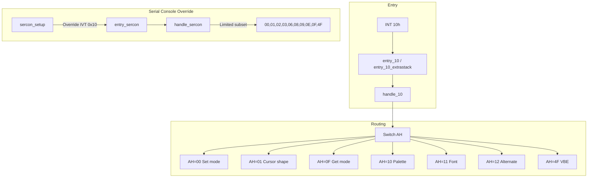

# Video Services (INT 10h)

This page documents the BIOS video services implemented in SeaBIOS and invoked via **INT 10h**. It lists every supported function (AH code and subfunctions), register inputs and outputs, and how the handler relates to the VGA/VBE implementation and to the serial console.

Implementation is in `vgasrc/vgabios.c` (main handler and dispatch), `vgasrc/vbe.c` (VBE extensions), and `vgasrc/vgaentry.S` (entry points). When serial console is enabled, `src/sercon.c` may override INT 10h and handle a subset of calls. Data structures are in `src/std/vga.h`, `src/std/vbe.h`, and `vgasrc/vgabios.h`.

## Overview

- **INT 10h** is the standard Video BIOS interrupt. The main handler is `handle_10()` in `vgasrc/vgabios.c`.
- **Entry points**: `entry_10` or `entry_10_extrastack` (when extra stack is enabled) in `vgasrc/vgaentry.S`. The IVT vector 0x10 is set in `vgasrc/vgainit.c`.
- **Serial console**: When `CONFIG_SERCON` and a sercon port are configured, `sercon_setup()` overrides IVT 0x10 with `entry_sercon`. Sercon handles only AH=00h, 01h, 02h, 03h, 06h, 08h, 09h, 0Eh, 0Fh, 4Fh. In split mode (when a VGA ROM is present), AH=01h, 02h, 03h, 08h, 0Fh are passed through to the vgabios handler instead of being handled by sercon.
- **VBE**: When `CONFIG_VGA_VBE` is set, AH=4Fh provides VESA BIOS Extensions; success is indicated by AX=0x004F, errors by 0x014F or 0x034F.

## Calling conventions

- **Register layout** matches `struct bregs` in `src/bregs.h` (DS, ES, EDI/DI, ESI/SI, EBP/BP, EBX/BX, EDX/DX, ECX/CX, EAX/AX, and flags). Segment:offset pointers typically use ES or DS as documented per function.
- **Function code** is in **AH**; many functions use **AL** or **BL** for subfunctions.

## BIOS Data Area (video)

Video-related BDA fields are documented in [BIOS_Data_Area.md](BIOS_Data_Area.md). Key locations include: `video_mode` (0x49), `video_cols` (0x4A), `video_rows` (0x84), `video_pagesize`, `video_pagestart`, `cursor_pos[8]`, `cursor_type`, `video_page`, `crtc_address`, `video_ctl`, `char_height`, `video_switches`, `modeset_ctl`, `dcc_index`. Custom VGA state at BDA offset 0xb9 (`struct vga_bda_s`) holds `flags`, `vbe_mode`, and `vgamode_offset`.

## Supported video modes

Mode lookup uses `vgahw_find_mode()` in `vgasrc/vgahw.h`, which dispatches to the active driver (stdvga, Cirrus, ATI, Bochs, or coreboot) according to `CONFIG_*`.

- **Standard VGA modes** (from `vgasrc/stdvgamodes.c`): 0x00–0x07, 0x0D–0x13, 0x6A (text and graphics).
- **VBE/SVGA modes** (from `vgasrc/svgamodes.c` and driver-specific tables): 0x100–0x11F, 0x140–0x146, and others depending on build. VBE mode numbers may be combined with flags (e.g. linear framebuffer, preserve memory) defined in `src/std/vbe.h`.

## Implementation flow

---

## Classic functions (AH 0x00–0x0F)

| AH | Function | Purpose |
|----|----------|---------|
| 00h | Set video mode | Set mode and optionally clear screen |
| 01h | Set cursor shape | Set cursor type or hide cursor |
| 02h | Set cursor position | Set row/col on given page |
| 03h | Get cursor position | Get position and shape for page |
| 04h | Read light pen | Unimplemented (returns zeros) |
| 05h | Select display page | Set active page (0–7) |
| 06h | Scroll window up | Scroll or clear rectangle |
| 07h | Scroll window down | Scroll rectangle down |
| 08h | Read character and attribute | At cursor on given page |
| 09h | Write character and attribute | With cursor advance |
| 0Ah | Write character only | Attribute unchanged |
| 0Bh | Set color palette | CGA background or palette (stdvga only) |
| 0Ch | Write pixel | Graphics mode pixel write |
| 0Dh | Read pixel | Graphics mode pixel read |
| 0Eh | Teletype output | Character output with CR/LF/BS/BEL handling |
| 0Fh | Get video mode | Current mode, columns, active page |

### AH=00h — Set video mode

- **Purpose**: Set the video mode and optionally clear display memory.
- **Inputs**: AL = mode (0x00–0x13 and driver-specific modes). Bit 7 of AL: 1 = do not clear display memory.
- **Outputs**: AL is set to a column indicator: 0x20 for 40-column, 0x3f for 80-column (mode 6), 0x30 for other 80-column. Registers otherwise unchanged.
- **Implementation**: `handle_1000()`; builds flags from `modeset_ctl` (e.g. MF_NOPALETTE, MF_GRAYSUM) and calls `vga_set_mode(mode, flags)`. Mode &gt; 7 leaves AL as 0x20; mode 6 forces AL=0x3f.
- **Relation**: BDA video fields and IVT 0x1F/0x43 (font pointers) are updated in `vga_set_mode()`.

### AH=01h — Set cursor shape

- **Purpose**: Set the cursor shape or hide the cursor.
- **Inputs**: CX = cursor type. High byte: start scan line (0x00–0x1F); low byte: end scan line. CX=0x0000 hides the cursor.
- **Outputs**: None.
- **Implementation**: `handle_1001()`; sets BDA `cursor_type` and, when CONFIG_VGA_STDVGA_PORTS, calls `stdvga_set_cursor_shape()` with the effective shape (cursor scaling applied in graphics modes when cursor emulation is on via `get_cursor_shape()`).

### AH=02h — Set cursor position

- **Purpose**: Set the cursor position on a given page.
- **Inputs**: BH = page (0–7); DH = row; DL = column.
- **Outputs**: None.
- **Implementation**: `handle_1002()`; builds `struct cursorpos` and calls `set_cursor_pos()`. If the page is the active page, the hardware cursor is updated; BDA `cursor_pos[page]` is always updated.

### AH=03h — Get cursor position

- **Purpose**: Return cursor shape and position for a page.
- **Inputs**: BH = page (0–7).
- **Outputs**: CX = cursor type (same format as AH=01h); DH = row; DL = column.
- **Implementation**: `handle_1003()`; reads BDA `cursor_type` and `cursor_pos[page]`.

### AH=04h — Read light pen position

- **Purpose**: Read light pen position (legacy hardware).
- **Outputs**: Unimplemented. AX, BX, CX, DX set to 0.
- **Implementation**: `handle_1004()`; `debug_stub(regs)`.

### AH=05h — Select display page

- **Purpose**: Set the active display page (0–7).
- **Inputs**: AL = page number.
- **Outputs**: None.
- **Implementation**: `handle_1005()`; `set_active_page()`. Computes the start address for the page, calls `vgahw_set_displaystart()`, and updates BDA `video_pagestart`, `video_page`, and the visible cursor.

### AH=06h — Scroll window up

- **Purpose**: Scroll a rectangle up by a number of lines, or clear it (AL=0).
- **Inputs**: AL = number of lines to scroll (0 = clear entire rectangle); BH = attribute for new lines; CH, CL = upper-left row, column; DH, DL = lower-right row, column.
- **Outputs**: None.
- **Implementation**: `handle_1006()` → `verify_scroll(regs, 1)`. Bounds are clamped to current rows/columns; then `vgafb_scroll()` is called with the window and fill attribute.

### AH=07h — Scroll window down

- **Purpose**: Scroll a rectangle down by a number of lines.
- **Inputs**: Same as AH=06h.
- **Outputs**: None.
- **Implementation**: `handle_1007()` → `verify_scroll(regs, -1)`.

### AH=08h — Read character and attribute at cursor

- **Purpose**: Read the character and attribute at the current cursor position on the given page.
- **Inputs**: BH = page (0–7).
- **Outputs**: AL = character code; AH = attribute.
- **Implementation**: `handle_1008()`; `vgafb_read_char(get_cursor_pos(regs->bh))`.

### AH=09h — Write character and attribute

- **Purpose**: Write a character with attribute at the cursor position, repeated CX times; cursor position advances.
- **Inputs**: AL = character; BH = page; BL = attribute; CX = count.
- **Outputs**: None.
- **Implementation**: `handle_1009()`; gets cursor position for page BH, then in a loop writes the character/attribute via `write_char()` and updates cursor (no special handling for CR/LF/BS).

### AH=0Ah — Write character only

- **Purpose**: Same as AH=09h but attribute is not changed (BL is ignored for the stored attribute).
- **Inputs**: AL = character; BH = page; CX = count.
- **Outputs**: None.
- **Implementation**: `handle_100a()`; uses attribute 0 in the internal `carattr` so existing attribute is preserved by the framebuffer layer where applicable.

### AH=0Bh — Set color palette (CGA)

- **Purpose**: Set CGA background color (BH=0) or CGA palette (BH=1).
- **Inputs**: BH = 0: BL = background color (0–15); BH = 1: BL = palette (0 or 1).
- **Outputs**: None.
- **Implementation**: `handle_100b()`. When CONFIG_VGA_STDVGA_PORTS: BH=0 → `stdvga_set_cga_background_color(regs->bl)`; BH=1 → `stdvga_set_cga_palette(regs->bl)`. Otherwise `debug_stub(regs)`.

### AH=0Ch — Write pixel

- **Purpose**: Write a pixel in graphics mode.
- **Inputs**: AL = color; CX = x; DX = y; BH = page (unused in implementation).
- **Outputs**: None.
- **Implementation**: `handle_100c()`; `vgafb_write_pixel(regs->al, regs->cx, regs->dx)`.

### AH=0Dh — Read pixel

- **Purpose**: Read the pixel color at (CX, DX) in graphics mode.
- **Inputs**: CX = x; DX = y; BH = page (unused).
- **Outputs**: AL = color.
- **Implementation**: `handle_100d()`; `vgafb_read_pixel(regs->cx, regs->dx)`.

### AH=0Eh — Teletype output

- **Purpose**: Output a character with interpretation: BEL (7), BS (8), CR, LF; other characters are written at the current cursor on the active page and cursor advances. Screen scrolls when past bottom.
- **Inputs**: AL = character; BL = attribute (for the character when written).
- **Outputs**: None.
- **Implementation**: `handle_100e()`; uses current page from BDA; `write_teletype()` handles special characters and scrolling; then `set_cursor_pos(cp)`.

### AH=0Fh — Get current video mode

- **Purpose**: Return current mode, number of columns, and active page.
- **Inputs**: None.
- **Outputs**: AL = current video mode (or 0xFF for VBE mode); AH = number of columns; BH = active display page.
- **Implementation**: `handle_100f()`; reads BDA `video_page`, `video_mode` (with bit 7 from `video_ctl`), and `video_cols`.

---

## Palette and DAC functions (AH=10h)

Subfunction in **AL**. Require `CONFIG_VGA_STDVGA_PORTS`; otherwise `debug_stub(regs)`.

| AL | Function | Inputs | Outputs |
|----|----------|--------|---------|
| 00h | Set single attribute register | BL = index (0–0x14), BH = value | — |
| 01h | Set overscan border color | BH = color | — |
| 02h | Set all palette and DAC | ES:DX = pointer to 256×3 RGB values | — |
| 03h | Toggle palette blinking | BL = 0 or 1 | — |
| 07h | Read single attribute register | BL = index | BH = value |
| 08h | Get overscan border color | — | BH = color |
| 09h | Get all palette registers | ES:DX = buffer | Buffer filled |
| 10h | Set single DAC register (RGB) | BX = index; CH = green, DH = red, CL = blue | — |
| 12h | Set DAC block | ES:DX = buffer (RGB triplets), BX = start index, CX = count | — |
| 13h | Set palette page / size | BL bit 0: 0 = set page size (BH), 1 = set page (BH) | — |
| 15h | Read single DAC register (RGB) | BX = index | DH = red, CH = green, CL = blue |
| 17h | Read DAC block | ES:DX = buffer, BX = start, CX = count | Buffer filled |
| 18h | Set PEL mask | BL = mask | — |
| 19h | Read PEL mask | — | BL = mask |
| 1Ah | Get palette page and size | — | BL = page, BH = page size |
| 1Bh | Gray-scale summing | BX = start index, CX = count | — |

Implementation: `handle_1010()` in `vgabios.c` dispatches to `stdvga_*` helpers (e.g. `stdvga_attr_write`, `stdvga_dac_write`, `stdvga_set_palette_blinking`). Index &gt; 0x14 is ignored for 00h/07h.

---

## Character generator (AH=11h)

| AL | Function | Inputs | Outputs |
|----|----------|--------|---------|
| 00h | Load user font (text) | ES:BP = font, CX = chars, DX = row, BL = block | — |
| 01h | Load ROM font 14-line | BL = block | — |
| 02h | Load ROM font 8-line | BL = block | — |
| 03h | Set block specifier | BL = block | — |
| 04h | Load ROM font 16-line | BL = block | — |
| 10h | Load user font + set char height | ES:BP = font, CX, DX, BL, BH = height | — |
| 11h | Load 14-line font + set height 14 | BL = block | — |
| 12h | Load 8-line font + set height 8 | BL = block | — |
| 14h | Load 16-line font + set height 16 | BL = block | — |
| 20h | Set user graphics font pointer | ES:BP = font (IVT 0x1F) | — |
| 21h–24h | Load graphics font (14/8/16 line) | BL, DL = rows | — |
| 30h | Get font information | BH = font type (0–7) | ES:BP = font ptr, CX = bytes per char, DL = rows |

Font type in 30h: 0 = INT 0x1F, 1 = INT 0x43, 2–7 = internal ROM fonts (vgafont14, vgafont8, vgafont8+128, vgafont14alt, vgafont16, vgafont16alt). Implementation: `handle_1011()`; when CONFIG_VGA_STDVGA_PORTS the load subfunctions call `stdvga_load_font()` or `load_gfx_font()`; 30h and 20h/21h–24h use IVT 0x1F/0x43 and BDA `char_height`, `video_rows`.

---

## Alternate select (AH=12h)

Subfunction in **BL**. Standard subfunctions:

| BL | Function | Inputs | Outputs |
|----|----------|--------|---------|
| 10h | Get video subsystem config | — | BX = config (0x0003 or 0x0103 for MDA), CX = video switches |
| 30h | Select vertical resolution | AL = 0 (200), 1 (350), 2 (400) lines | AL = 0x12 |
| 31h | Enable/disable default palette | AL = 0 or 1 | AL = 0x12 |
| 32h | Enable video addressing | AL = 0 or 1 | AL = 0x12 |
| 33h | Select gray-scale summing | AL = 0 or 1 | AL = 0x12 |
| 34h | Cursor emulation (graphics) | AL = 0 or 1 | AL = 0x12 |
| 35h, 36h | Reserved | — | debug_stub, AL = 0x12 |

When `CONFIG_VGA_CIRRUS` and BL ≥ 0x80, `clext_1012()` in `vgasrc/clext.c` handles: 80h (chip ID), 81h (stub), 82h (CRTC 0x27), 85h (memory size in 64K blocks), 9Ah (version), A0h (mode table/callback), A1h (monitor), A2h (sync range), AEh (refresh). Implementation: `handle_1012()`.

---

## Write string (AH=13h)

- **Purpose**: Write a string of characters (and optionally attributes) at a position, with optional cursor update.
- **Inputs**: ES:BP = string; AL = mode (bit 0: update cursor after; bit 1: each character has alternate attribute in string); BH = page; BL = attribute (used when AL bit 1 = 0); CX = character count; DH, DL = row, column.
- **Outputs**: None.
- **Implementation**: `handle_1013()`; loop over string, interpret AL bit 1 for attribute, call `write_teletype()` for each character; if AL bit 0 set, `set_cursor_pos(cp)` at end.

---

## Display combination code (AH=1Ah)

| AL | Function | Inputs | Outputs |
|----|----------|--------|---------|
| 00h | Get display combination code | — | BX = DCC index, AL = 0x1A |
| 01h | Set display combination code | BL = index | AL = 0x1A (BH ignored in implementation) |

Implementation: `handle_101a()`; get/set BDA `dcc_index`.

---

## Video BIOS functionality (AH=1Bh)

- **Purpose**: Return a table describing video BIOS capabilities and current state.
- **Inputs**: ES:DI = pointer to `struct video_func_info` (see `src/std/vga.h`).
- **Outputs**: Buffer filled with: pointer to static functionality table, copy of BDA 0x49–0x66 and 0x84–0x86, DCC index, colors (16), pages (8), scan lines (2), video memory (3). AL = 0x1B.
- **Implementation**: `handle_101b()`; fills `video_func_info` including `static_functionality` (modes, scanlines, etc.) and BDA copy.

---

## Save/restore video state (AH=1Ch)

- **Purpose**: Query buffer size for, save, or restore video state.
- **Inputs**: AL = 0 (query), 1 (save), 2 (restore). CX = state flags: bit 0 = hardware, bit 1 = BDA, bit 2 = DAC, bit 3 = registers. ES:BX = buffer (for save/restore; for query, BX returns size in 64-byte blocks).
- **Outputs**: On query (AL=0), BX = size in 64-byte blocks. Invalid CX/AL leaves registers unchanged.
- **Implementation**: `handle_101c()`; validates CX (only bits 0–2 allowed) and AL ≤ 2; calls `vgahw_save_restore(states | (cmd<<8), seg, data)`. Driver-specific (stdvga, Cirrus, Bochs, coreboot) and may support SR_HARDWARE, SR_BDA, SR_DAC, SR_REGISTERS from `vgabios.h`.

---

## VBE (AH=4Fh)

When `CONFIG_VGA_VBE` is set, AH=4Fh is dispatched to `handle_104f()` in `vgasrc/vbe.c`. Return: **AX=0x004F** on success; **AX=0x014F** (unsupported/invalid) or **0x034F** (invalid in current mode) on failure.

| AL | Function | Inputs | Outputs |
|----|----------|--------|---------|
| 00h | Get VBE controller info | ES:DI = buffer for `struct vbe_info` | Buffer filled; signature VESA, version 0x0300, mode list in reserved area |
| 01h | Get VBE mode info | CX = mode number, ES:DI = buffer for `struct vbe_mode_info` | Buffer filled or 0x014f |
| 02h | Set VBE mode | BX = mode (plus flags: linear FB, preserve memory, etc.) | AH = 0 on success |
| 03h | Get current VBE mode | — | BX = current mode |
| 04h | Save/restore VBE state | DL = 0/1/2 (query/save/restore), CX = state bits (0–15), ES:BX = buffer | On query, BX = size in 64-byte blocks |
| 05h | Window control | BH = 0 set / 1 get, BL = window, DX = bank (set) | DX = bank (get); 0x014f if linear FB mode |
| 06h | Set/get logical scan line length | BL = 0 set in pixels (CX), 2 set in bytes (CX) | BX = bytes per line, CX = pixels, DX = lines |
| 07h | Set/get display start | BL = 0 set (CX=pixel X, DX=line), 1 get | DX = line, CX = pixel (get) |
| 08h | DAC format | BL = 0 set (BH=format), 1 get | BH = format (get); 0x034f for direct color/YUV |
| 09h | Set/get palette | BL = 0/0x80 set, 1 get; DL = start, CX = count, ES:DI = data | 0x034f for direct color or &gt;8 bpp; 0x0100 if no stdvga ports |
| 0Ah | (Reserved) | — | AX = 0x0100 (stub) |
| 10h | Power management | BL = 0 get (BX=0x0f30), 1 set (BH=PM state), 2 PM interface | BX = 0x0f30 for BL=0 |
| 15h | Get EDID | BL = 0 size/version, 1 block (DX = block) | ES:DI filled for block; BX = 0x0103 for size |

Structures and flags (e.g. VBE_MODE_ATTRIBUTE_*, VBE_MODE_LINEAR_FRAME_BUFFER) are defined in `src/std/vbe.h`. `entry_104f05` in `vgaentry.S` is the window function pointer returned in mode info.

---

## Unsupported functions

Any AH not listed above (e.g. 0x14–0x19, 0x1D–0x4E, 0x50 and above) is passed to `handle_10XX()` which calls `debug_stub(regs)` and does not change behavior.

---

## Shared data structures

- **`struct video_func_static`**, **`struct video_func_info`** — `src/std/vga.h`: static functionality and full video info for AH=1Bh.
- **`struct vbe_info`**, **`struct vbe_mode_info`**, **`struct vbe_palette_entry`** — `src/std/vbe.h`: VBE controller and mode info, palette entry.
- **`struct vgamode_s`** — `vgasrc/vgabios.h`: internal mode descriptor (memmodel, width, height, depth, cwidth, cheight, sstart). Mode tables live in `vgasrc/stdvgamodes.c`, `vgasrc/svgamodes.c`, and driver-specific files.

For BDA layout and video-related fields, see [BIOS_Data_Area.md](BIOS_Data_Area.md).
